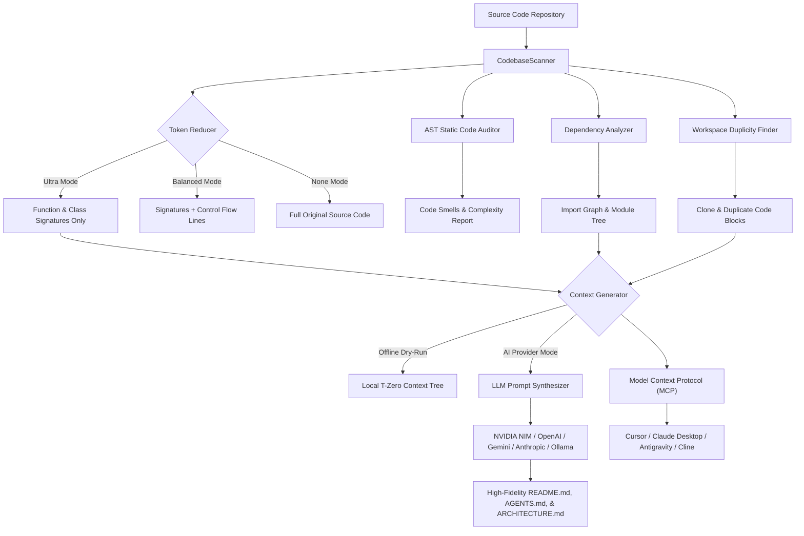
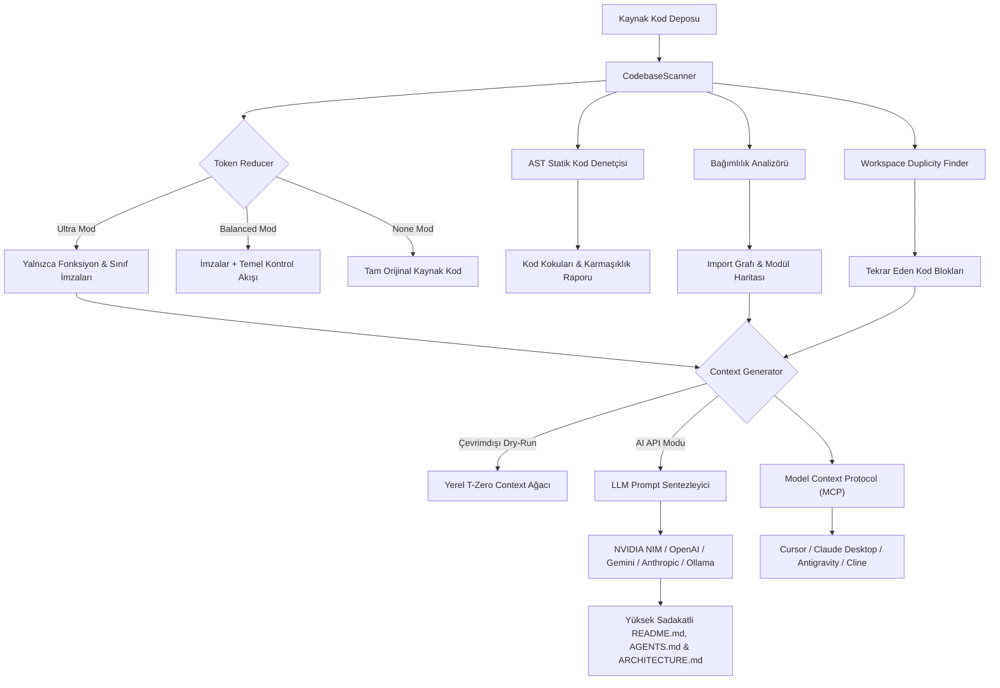

# ⚡ SİBER AKADEMİ — T-ZERO CONTEXT ARCHITECT V3

<p align="center">
  <a href="#-english"><b>🇬🇧 English Documentation</b></a> • 
  <a href="#-türkçe"><b>🇹🇷 Türkçe Dokümantasyon</b></a>
</p>

<p align="center">
  <a href="https://pypi.org/project/tzero-mcp/"></a>
  
  
  
  
  
  
</p>

> **Enterprise-Grade Codebase Context Builder, AST Signatures Analyzer, and Token Reducer.**  
> Built for Cursor, VS Code Copilot, Cline, Antigravity IDE, Claude Code, and ChatGPT. Cuts LLM context ingestion overhead by **up to 95%** while preserving the structural outline of your code (signatures, hierarchy, dependencies).  
> Includes a native **Model Context Protocol (MCP)** server for autonomous AI coding agents.

**Developer:** Toprak Ahmet Aydoğmuş  
**LinkedIn:** [Toprak Ahmet Aydoğmuş](https://linkedin.com/in/toprak-ahmet-aydo%C4%9Fmu%C5%9F-60462534b/)  
**Bio & Hub:** [https://hopp.bio/siberegitim](https://hopp.bio/siberegitim)  
**GitHub Repository:** [https://github.com/toprakahmetaydogmus/TZeroAlgorithm](https://github.com/toprakahmetaydogmus/TZeroAlgorithm)

---

# 🇬🇧 English

## Table of Contents
1. [Security Architecture (100% Zero-Leak Guarantee)](#-security-architecture-100-zero-leak-guarantee)
2. [Model Context Protocol (MCP) Server](#-model-context-protocol-mcp-server)
3. [System Architecture](#-system-architecture)
4. [Core Highlights & Capabilities](#-core-highlights--capabilities)
5. [Installation & Setup](#-installation--setup)
6. [Usage Guide (GUI & CLI)](#-usage-guide-gui--cli)
7. [Keyboard Shortcuts](#-keyboard-shortcuts)
8. [Project Structure](#-project-structure)
9. [Automated Test Suite & CI/CD](#-automated-test-suite--cicd)
10. [License & Credits](#-license--credits)

---

## 🔒 Security Architecture (100% Zero-Leak Guarantee)

> [!IMPORTANT]
> **T-Zero Algorithm strictly contains ZERO hardcoded, personal, or public API keys or credentials anywhere in the repository.**  
> Defense-in-depth and zero-trust principles are enforced by default.

1. **OS-Level Credential Encryption (Keyring Engine):**
   - API keys are never written to plain-text configuration files or logs.
   - Stored through the cross-platform [`keyring`](https://pypi.org/project/keyring/) library, which uses the native OS store:
   - **Windows:** Windows Credential Manager
   - **macOS:** Apple Keychain
   - **Linux:** Secret Service API (GNOME Keyring / KWallet via DBus)
2. **Zero Telemetry & Absolute Privacy:**
   - Your source code, tokens, file structure, and API credentials are never sent to any third-party telemetry, analytics, or developer servers.
   - Outbound network traffic is exclusively initiated directly from your client to the AI provider endpoint chosen by you (NVIDIA, OpenAI, Google, Anthropic, OpenRouter, or localhost Ollama).
   - The optional local web dashboard (`--web`) binds to `127.0.0.1` only; its page loads a web font from Google Fonts in your browser.
3. **Password-Obfuscated Keyring Backup:**
   - API keys can be backed up to a password-protected `.dat` binary file. This uses a simple repeating-key XOR (no salt, not strong cryptography), so keep the file private and treat it like a secret. It is git-ignored by default.
4. **12-Factor Environment Variable Detection:**
   - Automatically detects and inherits standard system environment variables when present:
     - `NVIDIA_API_KEY`
     - `OPENAI_API_KEY`
     - `GEMINI_API_KEY`
     - `OPENROUTER_API_KEY`
     - `ANTHROPIC_API_KEY`
5. **100% Offline Dry-Run Mode ($0 Cost):**
   - Generate full-featured context trees, AST signature maps, and markdown blueprints without any internet connection, API keys, or AI provider subscriptions.

---

## 🤖 Model Context Protocol (MCP) Server

T-Zero V3 natively embeds a standard **Model Context Protocol (MCP)** server (`tzero_mcp.py`) operating over `stdio`. This empowers AI agents in **Cursor**, **Claude Desktop**, **Antigravity IDE**, and **Cline** to autonomously inspect, prune, and query your project's codebase before writing a single line of code.

### 🛠 Available MCP Tools (13 Autonomous Tools)

| Tool Name | Parameters | Purpose |
|:----------|:-----------|:--------|
| `get_project_context_tree` | `project_root`, `reduction_mode`, `max_tokens`, `include_file_contents` | Scans workspace and builds a multi-tier T-Zero hierarchical context tree (T-1 to T-4). Reduces tokens by up to 95%. |
| `query_module_dependencies` | `project_root`, `file_path` | Analyzes incoming and outgoing import dependencies, local links, and external packages for a file or entire project. |
| `query_architecture_boundaries` | `project_root`, `extra_guidance` | Queries active T-4 architectural boundaries, operational constraints, and Zero-Leak rules for coding agents. |
| `generate_architecture_blueprint` | `project_root` | Generates a complete system architecture specification (`ARCHITECTURE.md`) with live Mermaid topology diagrams. |
| `generate_repo_map` | `project_root`, `max_tokens` | Produces an ultra-compressed AST symbol map (classes, methods, signatures) optimized for prompt injection. |
| `audit_codebase_quality` | `project_root`, `file_path` | Runs an AST static code smell check and secret leak scan (detects functions >30 lines, global vars, missing docstrings). |
| `find_code_duplicity` | `project_root`, `min_lines` | Scans the workspace to identify repeated/duplicate blocks of code across files for refactoring. |
| `estimate_token_cost` | `text`, `project_root`, `reduction_mode` | Computes exact token count and USD cost comparison across OpenAI, Claude, Groq, NVIDIA NIM, and Ollama ($0). |
| `analyze_change_impact` | `target_symbol`, `project_root` | Traces AST symbol definitions, caller cascades, inbound dependents, and calculates a 0-100 risk score. |
| `enforce_architecture_boundaries` | `project_root`, `rules_file` | Validates modular import boundaries against `tzero.rules.json` to prevent architectural erosion. |
| `search_codebase_semantic` | `query`, `project_root`, `top_k` | 100% private, local in-memory BM25 + TF-IDF hybrid semantic code search and RAG engine ($0 cost, 0 leaks). |
| `export_agent_rules` | `project_root` | Generates 1-click rules for Cursor (`.cursorrules`, `.cursor/rules/*.mdc`), Cline (`.clinerules`), and Copilot. |
| `get_token_savings_metrics` | `project_root`, `team_size` | Calculates quantitative token reduction ratio, monthly/annual cost savings, and team developer ROI metrics. |

### 🧭 MCP Prompts
- **`tzero_grounding`**: Injects strict architectural boundary rules, modular integrity guidelines, and Zero-Leak security mandates into the agent's system session.

### 📊 Token Benchmark (Single-File Example)

Measured on `tzero_v3.py` at commit `4846dcf` with the project's `count_tokens_precise` estimator (approximately `characters / 4`):

| Input | Full source estimate | Ultra AST signatures | Estimated reduction |
|:------|---------------------:|---------------------:|---------------------:|
| `tzero_v3.py` (224,150 characters) | 56,037 tokens | 3,088 tokens | 94.5% |

Reproduce it with: `python -c "from pathlib import Path; from tzero_v3 import TokenReducer,count_tokens_precise; s=Path('tzero_v3.py').read_text(encoding='utf-8'); r=TokenReducer.reduce(s,'tzero_v3.py',mode='ultra'); print(count_tokens_precise(s),count_tokens_precise(r))"`. This is a single-file, signatures-only comparison, not a whole-repository or answer-quality benchmark; provider tokenizers and MCP response overhead vary. Use `balanced` or fetch source when implementation details matter.

### 🔌 Add T-Zero to MCP Clients

T-Zero runs as a local stdio server with full support for Cursor, Claude Desktop, Antigravity IDE, VS Code, Windsurf, Cline, and Roo Code.

#### 🚀 Option 1: 1-Minute Quickstart with pip (Official PyPI — Cross-Platform)

The fastest and standard way to install and run T-Zero on Windows, macOS, or Linux:

```bash
pip install tzero-mcp
```

Once installed, use any of the available interfaces:

1. **Auto-Configure All Detected IDEs (Cursor, Claude, Antigravity, VS Code, Cline):**
   ```bash
   tzero-add-mcp
   ```
2. **Interactive Terminal Wizard (CLI):**
   ```bash
   tzero --cli
   ```
3. **Desktop Cyberpunk GUI Dashboard:**
   ```bash
   tzero-gui
   # or:
   tzero --gui
   ```
4. **Manual MCP Client Configuration:**
   Simply add this stdio block to your client config (`mcp_config.json`, `claude_desktop_config.json`, or Cursor settings):
   ```json
   {
     "mcpServers": {
       "tzero": {
         "command": "tzero-mcp"
       }
     }
   }
   ```

---

#### ⚡ Option 2: 1-Click Zero-Dependency Windows Installer (Standalone Binary)

Download **`AddMCP.exe`** directly from [Latest Release (v3.0.5)](https://github.com/toprakahmetaydogmus/TZeroAlgorithm/releases):
- **GUI Mode:** Double-click `AddMCP.exe`. It automatically detects all installed IDEs on your computer and configures them with a single click.
- **CLI / Headless Mode:** Run `AddMCP.exe --all` (automatically installs to all detected IDEs without a GUI).
- **Zero Requirements:** Does **not** require Python, pip, pipx, or Git. Bundles the standalone `TZeroMCP.exe` runtime internally.

---

#### 📦 Option 3: Remote Launch via pipx (Cross-Platform: Windows, macOS, Linux)

The first launch downloads the pinned `v3.0.5` package from GitHub without cloning the repo. Install Python 3.9+ and pipx:

##### Install pipx on Windows
Open PowerShell and run:
```powershell
py -m pip install --user pipx
py -m pipx ensurepath
```

Restart the client after installation. The Windows configs below call `py -m pipx` directly, so they do not depend on `pipx.exe` being on PATH. For macOS/Linux, install pipx using the [official platform instructions](https://pipx.pypa.io/stable/installation/) and run `pipx ensurepath`.

#### Cursor One-Click Install

Choose the link for your operating system, approve the configuration in Cursor, then enable `tzero` under **Settings → MCP** or **Customize → MCP**.

- [Add T-Zero to Cursor (Windows)](https://cursor.com/install-mcp?name=tzero&config=eyJjb21tYW5kIjoicHkiLCJhcmdzIjpbIi1tIiwicGlweCIsInJ1biIsIi0tc3BlYyIsImdpdCtodHRwczovL2dpdGh1Yi5jb20vdG9wcmFrYWhtZXRheWRvZ211cy9UWmVyb0FsZ29yaXRobS5naXRAdjMuMC41IiwidHplcm8tbWNwIl19)
- [Add T-Zero to Cursor (macOS/Linux)](https://cursor.com/install-mcp?name=tzero&config=eyJjb21tYW5kIjoicGlweCIsImFyZ3MiOlsicnVuIiwiLS1zcGVjIiwiZ2l0K2h0dHBzOi8vZ2l0aHViLmNvbS90b3ByYWthaG1ldGF5ZG9nbXVzL1RaZXJvQWxnb3JpdGhtLmdpdEB2My4wLjUiLCJ0emVyby1tY3AiXX0%3D)

If Cursor does not open the installer, use **Settings → MCP → Add Custom MCP** and paste the platform-appropriate JSON below.

**Windows:**
```json
{
  "mcpServers": {
    "tzero": {
      "command": "py",
      "args": ["-m", "pipx", "run", "--spec", "https://github.com/toprakahmetaydogmus/TZeroAlgorithm/archive/refs/tags/v3.0.5.zip", "tzero-mcp"]
    }
  }
}
```

**macOS/Linux:**
```json
{
  "mcpServers": {
    "tzero": {
      "command": "pipx",
      "args": ["run", "--spec", "https://github.com/toprakahmetaydogmus/TZeroAlgorithm/archive/refs/tags/v3.0.5.zip", "tzero-mcp"]
    }
  }
}
```

#### Claude Desktop

1. Open **Settings → Developer → Edit Config**.
2. Merge the matching Windows or macOS/Linux JSON block above into the existing `mcpServers` object; keep other server entries.
3. Save the file and fully quit/reopen Claude Desktop.
4. Return to **Settings → Developer** and confirm `tzero` is running.

Config locations: Windows `%APPDATA%\Claude\claude_desktop_config.json`; macOS `~/Library/Application Support/Claude/claude_desktop_config.json`.

#### Google Antigravity IDE

1. Open **Settings → Customizations → Installed MCP Servers**.
2. **Add MCP** opens the Antigravity MCP Store. If T-Zero appears there, select **Add**; otherwise configure it as a custom stdio server below.
3. Add the Windows or macOS/Linux `tzero` entry from the JSON blocks above to Antigravity's `mcp_config.json`, preserving other `mcpServers` entries. On Windows, the user config is `%USERPROFILE%\.gemini\config\mcp_config.json` (or `~/.gemini/antigravity/mcp_config.json`).
4. Save/reload MCP servers and approve the tools when prompted.

##### ⚡ Antigravity Slash Command & Skill (`/tzero`)
T-Zero includes a native Antigravity skill (`.agents/skills/tzero/SKILL.md` and `~/.gemini/config/skills/tzero/SKILL.md`).
Simply type `/tzero` in the Antigravity chat prompt to view available actions or run:
- `/tzero` or `/tzero tree` — Builds multi-tier context tree with 95% token reduction
- `/tzero audit` — Runs AST code smell check and 100% Zero-Leak security audit
- `/tzero arch` — Generates ARCHITECTURE.md with live Mermaid diagrams
- `/tzero deps [file]` — Traces module dependency topology
- `/tzero impact <symbol>` — Computes blast radius score before refactoring
- `/tzero rules` — Generates .cursorrules, .clinerules, Copilot instructions
- `/tzero search <query>` — Runs 100% private local BM25 semantic code search
- `/tzero savings` — Computes developer team token ROI metrics

See the [official Antigravity MCP guide](https://antigravity.google/docs/mcp) for the current Settings flow and configuration schema.

#### VS Code Copilot

1. Run **MCP: Add Server** from the Command Palette (`Ctrl+Shift+P`).
2. Choose **Command (stdio)**, then enter the platform command (`py` on Windows; `pipx` on macOS/Linux) and the same arguments shown above.
3. Save to the workspace `.mcp.json` or `.vscode/mcp.json`, then trust/start `tzero` from the MCP Servers view.

For `.vscode/mcp.json`, VS Code uses a top-level `servers` object and requires `type: "stdio"`:
```json
{
  "servers": {
    "tzero": {
      "type": "stdio",
      "command": "py",
      "args": ["-m", "pipx", "run", "--spec", "https://github.com/toprakahmetaydogmus/TZeroAlgorithm/archive/refs/tags/v3.0.5.zip", "tzero-mcp"]
    }
  }
}
```

#### Claude Code, Cline, Roo Code, Windsurf, and Other MCP Clients

Open each client's MCP server settings, choose **Add/Edit Server**, and merge the matching Windows or macOS/Linux `mcpServers` entry above. Claude Code can use the same entry in a project-root `.mcp.json`; Cline, Roo Code, and Windsurf provide their own MCP server settings panels. Restart/reload the client and approve the server.

Only Cursor currently provides a verified public one-click install URL for arbitrary local stdio servers. The other clients use their documented settings/config files; the JSON above is ready to paste.

#### CLI Launch
```bash
python tzero_mcp.py
# Or: python main.py --mcp
```

---

## 🏗 System Architecture



---

## 🌟 Core Highlights & Capabilities

### 1. Multi-LLM Provider Engine
- **NVIDIA NIM:** `llama-3.3-70b-instruct`, `deepseek-r1`, `mistral-large`, `nemotron-51b`, `qwen3.5`
- **OpenAI:** `gpt-4o`, `gpt-4o-mini`, `o3-mini`, `o1`
- **Google Gemini:** `gemini-2.5-pro`, `gemini-2.5-flash`, `gemini-2.0-flash`
- **Anthropic:** `claude-3-7-sonnet-20250219`, `claude-3-5-sonnet`, `claude-3-5-haiku`
- **OpenRouter:** Universal gateway for `claude-3.7-sonnet`, `gpt-4o`, `deepseek-r1`
- **Local Ollama:** `llama3:latest`, `mistral:latest`, `phi3:latest`, `qwen2.5:latest` (100% local, offline, private, and free)

### 2. AST Token Reducer (Up to 95% Token Savings)
- **Ultra Mode:** Strips implementation internals while preserving class hierarchies, function headers, docstrings, decorators, and type hints.
- **Balanced Mode:** Retains signatures alongside critical control flow and exception handling statements.
- **None Mode:** Preserves 100% of raw source code.
- Supported languages: **Python, JavaScript, TypeScript, JSX/TSX, C/C++, Go, Rust, HTML, CSS, Bash, Batch, JSON, YAML**.

### 3. Advanced Codebase Analysis Tools
- **AST Class & Method Outliner:** Generates a structured hierarchy of every class, method, argument list, and decorator.
- **Static Code Auditor:** Instantly flags missing docstrings, functions exceeding 30 lines, routines with 6+ parameters, and usage of the `global` keyword (supports both synchronous `def` and asynchronous `async def`).
- **Dependency Analyzer:** Scans AST import statements to compile an external and internal module dependency map.
- **Workspace Duplicity Finder:** Identifies identical duplicate blocks of 6+ lines across the entire codebase.
- **AST Refactoring Engine:** Performs safe global function and identifier renames across workspace files using AST node transformation.

### 4. Git VCS Integration & Visual Telemetry
- **Commit History Classifier:** Classifies recent commits automatically (Added, Fixed, Refactored, Updated).
- **Color-Coded Git Diff Viewer:** Displays real-time uncommitted changes (`git diff HEAD`) with syntax highlighting.
- **Integrated Git Manager:** Stage, commit, and switch branches directly from the GUI.
- **Interactive Dependency Node Graph:** Draggable physics-based node visualization of file relationships.
- **Live CPU & RAM Telemetry:** Real-time hardware telemetry monitors system resource overhead.
- **Token Donut Canvas Chart:** Dynamic visual breakdown of file types, code volume, and token consumption.

### 5. Futuristic UI, Dynamic Particle FX & Haptic Audio SFX
- **8 Curated Themes:**
  - 🌌 `Glass Dark` (Frosted cyan accents)
  - ⚡ `Neon Cyberpunk` (Vibrant hot-pink & electric blue)
  - 🖤 `Midnight OLED` (100% pure black #000000 for zero eye strain)
  - 🟢 `Matrix Terminal` (Classic phosphor green #00ff41)
  - 🌆 `Synthwave 80s` (Laser magenta, neon orange, and retro cyan)
  - ❄️ `Nordic Frost` (Arctic slate and glacier blue)
  - ☕ `Solarized Amber` (Warm deep espresso and golden amber)
  - 🕹 `Siber Retro` (Classic hacker aesthetic)
- **4-Mode Dynamic Particle Engine:**
  - 🌌 **Stars:** High-speed 3D depth-warping starfield.
  - 🟢 **Matrix Rain:** Digital cascading green code glyphs.
  - 🌐 **Cyber Grid:** Retro-perspective horizon wireframe wave.
  - ⬛ **Solid Minimal:** Distraction-free dark canvas with 0% CPU consumption.
- **Haptic SFX Engine:** Non-blocking auditory feedback for actions (scans, copies, exports, errors) with an instant header toggle (`🔊 SFX ON` / `🔇 SFX OFF`).
- **Floating Cyberpunk Toasts:** Non-intrusive status banners that inform you of saves and exports without interrupting workflow.

### 6. Multi-Format Context Export Hub
- **`README.md`:** Comprehensive architectural documentation.
- **`AGENTS.md` / `CLAUDE.md`:** Specially structured context blueprint for AI coding assistants (Cursor, Antigravity IDE, Claude Code, Cline, Copilot) containing architecture rules, AST summaries, and workspace conventions.
- **`ARCHITECTURE.md`:** System architecture blueprint with auto-generated Mermaid topology diagrams.
- **`REPO_MAP.txt`:** Highly compressed AST symbol token map tailored for pasting directly into LLM chat prompts.
- **`README.html`:** Styled cyberpunk dark-mode HTML documentation that launches in your default web browser with one click.
- **Live Token Budget & USD Cost Estimator:** Real-time token counter and estimated API cost per model (OpenAI, Claude, Groq, NVIDIA NIM, Ollama).

---

## 📦 Installation & Setup

### Method 1: One-Click Installer (Recommended for Windows)
```cmd
install_requirements.bat
```
> Automatically provisions Python 3.12 (if not detected), configures a virtual environment, and installs all dependencies without requiring manual setup.

### Method 2: Standalone Portable Executable (.exe)
Download `TZeroAlgorithm.exe` for the desktop app. To add MCP to detected IDEs, run `AddMCP.exe`; it bundles `TZeroMCP.exe`, needs no Python or pipx, preserves existing server entries, and backs up config files before changing them. `TZeroMCP.exe` is also available separately for manual setup.

### Method 3: Python Package / pip Installation
```bash
# Install from a cloned checkout
git clone https://github.com/toprakahmetaydogmus/TZeroAlgorithm.git
cd TZeroAlgorithm
pip install .
# The package provides the `tzero` and `tzero-mcp` commands.

# After the package is published to PyPI:
pipx install tzero-algorithm
```
> The PyPI project name is `tzero-algorithm`; `tzero-mcp` is the installed command. Until the first PyPI upload, use the GitHub `pipx run --spec` configuration above.

> **Automatic dependency check:** on startup T-Zero verifies its required packages and installs any that are missing or too old (progress goes to stderr, so MCP stdio stays clean). Opt out with `TZERO_NO_AUTO_INSTALL=1`. Run `python main.py --doctor` for a full health check. The desktop GUI needs `tkinter`; the CLI and the MCP server work without it, so headless servers, Docker and CI are fine.

---

## 🎮 Usage Guide (GUI & CLI)

### 1. Graphical User Interface (GUI)
```bash
# Launch via Python
python main.py

# Or launch via Windows batch script
run.bat

# Or launch via legacy wrapper
python tzero.py
```

### 2. Command Line Interface (CLI)
T-Zero V3 offers a full suite of CLI flags for terminal enthusiasts and automated CI/CD pipelines:

```bash
# 1. Start Model Context Protocol (MCP) stdio server
python main.py --mcp

# 2. Scan directory and print metric table
python main.py --scan .

# 3. Audit codebase quality and detect code smells
python main.py --audit .

# 4. Generate offline context tree locally ($0 API cost)
python main.py --dry-run --dir . --output README.md

# 5. Generate AI Agent Rules & Blueprint (AGENTS.md / CLAUDE.md)
python main.py --export-agents AGENTS.md --dir .

# 6. Generate System Architecture Specification (ARCHITECTURE.md)
python main.py --export-arch ARCHITECTURE.md --dir .

# 7. Generate Compressed Token Symbol Map (REPO_MAP.txt)
python main.py --export-repomap REPO_MAP.txt --dir .

# 8. Generate Cyberpunk Styled HTML Preview (README.html)
python main.py --export-html README.html --dir .

# 9. Launch Interactive Terminal Wizard
python main.py --cli

# 10. Print current engine version
python main.py --version

# 11. Analyze blast radius of changing a symbol
python main.py --impact MyClass

# 12. Private local semantic code search (BM25 + TF-IDF)
python main.py --search "retry logic"

# 13. Enforce architecture boundaries in CI (exits 1 on violation)
python main.py --enforce-boundaries

# 14. Token reduction metrics and team ROI
python main.py --savings

# 15. Export native agent rules (.cursorrules, .clinerules, Copilot)
python main.py --export-agent-rules

# 16. Launch local web dashboard (default port 7300)
python main.py --web

# 17. Launch the desktop GUI
python main.py --gui

# 18. Check Python, dependencies, tkinter, git and keyring (installs what is missing)
python main.py --doctor
```

---

## ⌨️ Keyboard Shortcuts

| Shortcut | Action |
|----------|--------|
| `Ctrl+S` | Scan Active Workspace Directory |
| `Ctrl+G` | Generate / Compile Context Tree |
| `Ctrl+C` | Copy Generated Context to Clipboard |
| `Ctrl+R` | Refresh Git Log & Branches |

---

## 📂 Project Structure

```
TZeroAlgorithm/
├── .mcp.json                    # Claude Code MCP integration
├── .cursor/
│   └── mcp.json                 # Pre-configured Cursor MCP integration
├── .github/
│   └── workflows/
│       ├── ci.yml               # Automated GitHub Actions test workflow
│       └── release.yml          # Builds TZeroAlgorithm.exe, TZeroMCP.exe, AddMCP.exe, and publishes releases
├── tests/
│   ├── __init__.py
│   ├── test_addmcp.py            # Installer config merge/backup and detection tests
│   ├── test_analyzer.py         # AST analysis and code smell unit tests
│   ├── test_cli.py              # CLI integration tests
│   ├── test_config.py           # Configuration & Keyring security tests
│   ├── test_exports.py          # Multi-format exports & token cost tests
│   ├── test_deps.py             # Dependency bootstrap & doctor tests
│   ├── test_features.py         # Feature module tests (impact, rules, search, ROI)
│   ├── test_headless.py         # No-tkinter, MCP output & secret-scan regression tests
│   ├── test_generator.py        # Template engine & context generator tests
│   ├── test_gui.py              # Tkinter GUI headless smoke tests
│   ├── test_mcp.py              # Model Context Protocol (MCP) server tests
│   ├── test_providers.py        # Multi-provider LLM adapter tests
│   └── test_scanner.py          # TokenReducer & CodebaseScanner tests
├── build_exe.bat                # One-click Windows PyInstaller build script
├── compile.py                   # PyInstaller asset packaging pipeline
├── addmcp.py                    # Windows installer for supported IDE MCP configs
├── install_requirements.bat     # Windows automated setup script
├── LICENSE                      # MIT Open Source License
├── main.py                      # Primary execution entrypoint (CLI & GUI)
├── pyproject.toml               # Modern PEP 517/621 packaging metadata
├── README.md                    # Bilingual comprehensive documentation
├── requirements.txt             # Production Python dependencies
├── run.bat                      # Windows quick-launch runner
├── siber_akademi.ico            # High-resolution application icon
├── tzero.py                     # Backward-compatibility API wrapper
├── tzero.rules.json             # T-4 architecture boundary rules
├── tzero_deps.py                # Dependency bootstrap and --doctor
├── tzero_features.py            # Impact analysis, boundary rules, semantic search, ROI, web dashboard
├── tzero_mcp.py                 # Standard Model Context Protocol (MCP) Server
├── tzero_v3.py                  # Monolithic portable T-Zero V3 core engine
└── WALKTHROUGH.md               # Technical architecture walkthrough
```

---

## 🧪 Automated Test Suite & CI/CD

Run all unit and integration tests locally:

```bash
python -m unittest discover -s tests -v
```

Expected output:
```
Ran 79 tests in ~4s
OK (the GUI smoke test is skipped when no display is available)
```

GitHub Actions automatically runs this test suite on every push and pull request across Ubuntu and Windows runners under Python 3.10, 3.11, and 3.12.

---

## 📄 License & Credits

This project is licensed under the **MIT License**. See the [LICENSE](LICENSE) file for complete terms.

**Toprak Ahmet Aydoğmuş** — Siber Akademi  
- 💼 **LinkedIn:** [toprak-ahmet-aydoğmuş](https://linkedin.com/in/toprak-ahmet-aydo%C4%9Fmu%C5%9F-60462534b/)  
- 🔗 **Links & Bio:** [hopp.bio/siberegitim](https://hopp.bio/siberegitim)  
- 🐙 **GitHub:** [@toprakahmetaydogmus](https://github.com/toprakahmetaydogmus)

---
---

# 🇹🇷 Türkçe

## İçindekiler
1. [Şifreli Güvenlik Mimarisi (%100 Zero-Leak Garantisi)](#-şifreli-güvenlik-mimarisi-100-zero-leak-garantisi)
2. [Model Context Protocol (MCP) Sunucusu](#-model-context-protocol-mcp-sunucusu)
3. [Sistem Mimarisi](#-sistem-mimarisi-1)
4. [Öne Çıkan Yetenekler & Özellikler](#-öne-çıkan-yetenekler--özellikler)
5. [Kurulum ve Başlangıç](#-kurulum-ve-başlangıç)
6. [Kullanım Kılavuzu (GUI & CLI)](#-kullanım-kılavuzu-gui--cli)
7. [Klavye Kısayolları](#-klavye-kısayolları)
8. [Proje Dizin Ağacı](#-proje-dizin-ağacı)
9. [Otomatik Test Süreci ve CI/CD](#-otomatik-test-süreci-ve-cicd)
10. [Lisans ve Geliştirici Bilgileri](#-lisans-ve-geliştirici-bilgileri)

---

## 🔒 Şifreli Güvenlik Mimarisi (%100 Zero-Leak Garantisi)

> [!IMPORTANT]
> **T-Zero Algorithm, kod tabanında kesinlikle sabit kodlanmış (hardcoded), şahsi veya umumi hiçbir API anahtarı veya kimlik bilgisi barındırmaz.**  
> Uygulama varsayılan olarak sıfır güven (zero-trust) ilkelerini uygular.

1. **İşletim Sistemi Düzeyinde Kimlik Şifreleme (OS Keyring Motoru):**
   - API anahtarları asla düz metin dosyalarında (`.env`, `.json`, `.txt`) veya loglarda saklanmaz.
   - Platformlar arası [`keyring`](https://pypi.org/project/keyring/) kütüphanesi üzerinden, işletim sisteminin yerel deposunda saklanır:
   - **Windows:** Windows Credential Manager
   - **macOS:** Apple Keychain
   - **Linux:** Secret Service API (GNOME Keyring / KWallet - DBus üzerinden)
2. **Sıfır Telemetri ve Tam Veri Gizliliği:**
   - Kaynak kodlarınız, token verileriniz, dosya hiyerarşiniz veya API anahtarlarınız asla üçüncü taraf telemetri, analitik veya geliştirici sunucularına iletilmez.
   - Tüm giden ağ trafiği yalnızca sizin belirlediğiniz AI sağlayıcısının (NVIDIA, OpenAI, Google, Anthropic, OpenRouter veya yerel Ollama) resmi uç noktasına doğrudan HTTPS üzerinden gerçekleştirilir.
   - İsteğe bağlı yerel web paneli (`--web`) yalnızca `127.0.0.1` üzerinde çalışır; sayfası tarayıcınızda Google Fonts'tan bir yazı tipi yükler.
3. **Parola Korumalı Yerel Yedekleme (Keyring Backup):**
   - API anahtarlarınızı taşımak veya yedeklemek istediğinizde, kullanıcı tanımlı bir parola ile basit tekrarlı anahtar XOR yöntemi uygulanarak ikili `.dat` dosyası oluşturulur. Bu yöntem tuzsuzdur ve güçlü bir şifreleme değildir; dosyayı gizli tutun ve bir sır gibi muamele edin. Varsayılan olarak git'e eklenmez.
4. **12-Factor Sistem Ortam Değişkeni Desteği:**
   - Sisteminizde tanımlı olan çevre değişkenlerini otomatik olarak algılar ve kullanıma sunar:
     - `NVIDIA_API_KEY`
     - `OPENAI_API_KEY`
     - `GEMINI_API_KEY`
     - `OPENROUTER_API_KEY`
     - `ANTHROPIC_API_KEY`
5. **%100 Çevrimdışı (Offline Dry-Run) Modu (0 TL Maliyet):**
   - Hiçbir API anahtarına, internet bağlantısına veya yapay zeka aboneliğine gerek kalmadan, tamamen yerel makinenizde tam kapsamlı context ağaçları, AST imza haritaları ve doküman taslakları oluşturabilirsiniz.

---

## 🤖 Model Context Protocol (MCP) Sunucusu

T-Zero V3, Anthropic'in standart **Model Context Protocol (MCP)** SDK'sını kullanarak `stdio` üzerinden haberleşen yerel bir sunucu (`tzero_mcp.py`) sunar. Bu sayede **Cursor**, **Claude Desktop**, **Antigravity IDE** ve **Cline** gibi yapay zeka ajanları, projede herhangi bir kod üretmeden veya değiştirmeden önce projenin hiyerarşik mimarisini, bağımlılık grafiğini ve sınırlarını sorgulayabilir.

### 🛠 Sunulan MCP Araçları (13 Otonom Araç)

| Araç Adı | Parametreler | Görevi ve Amacı |
|:---------|:-------------|:----------------|
| `get_project_context_tree` | `project_root`, `reduction_mode`, `max_tokens`, `include_file_contents` | Proje dizinini tarar; T-1 Master Architecture, T-2 Modül Referansları ve T-4 sınır kurallarını hiyerarşik bağlam olarak döndürür. Token kullanımını %95'e kadar azaltır. |
| `query_module_dependencies` | `project_root`, `file_path` | Belirli bir dosyanın veya tüm deponun içe/dışa aktarım (import/export), dahili bağlar ve harici paket imza haritasını çeker. |
| `query_architecture_boundaries` | `project_root`, `extra_guidance` | Yapay zeka ajanları için aktif mimari sınırları (T-4), kuralları ve Zero-Leak kısıtlamalarını sorgular. |
| `generate_architecture_blueprint` | `project_root` | Otomatik Mermaid topoloji şeması içeren sistem mimarisi dokümanı (`ARCHITECTURE.md`) üretir. |
| `generate_repo_map` | `project_root`, `max_tokens` | LLM sohbetleri için aşırı sıkıştırılmış AST simge haritası (sınıflar, metotlar, imzalar) üretir. |
| `audit_codebase_quality` | `project_root`, `file_path` | AST statik kod kokusu analizi ve gizli anahtar/şifre sızıntısı taraması gerçekleştirir (30+ satır fonksiyonlar, global anahtarlar). |
| `find_code_duplicity` | `project_root`, `min_lines` | Çalışma alanında 6+ satırlık kopya/tekrar kod bloklarını tespit eder. |
| `estimate_token_cost` | `text`, `project_root`, `reduction_mode` | Verilen metin veya dizin için OpenAI, Claude, Groq, NVIDIA NIM ve Ollama ($0) modelleri üzerinden tam token ve USD maliyet tablosu çıkarır. |
| `analyze_change_impact` | `target_symbol`, `project_root` | Refactoring öncesi AST sembol tanımları, çağıran zincirleri ve 0-100 risk skoru ile etki yarıçapını (blast radius) hesaplar. |
| `enforce_architecture_boundaries` | `project_root`, `rules_file` | `tzero.rules.json` kurallarına göre katmanlar arası yasaklı importları denetler ve mimari bozulmayı engeller. |
| `search_codebase_semantic` | `query`, `project_root`, `top_k` | %100 yerel ve gizli, bellek içi BM25 + TF-IDF hibrit anlamsal kod arama ve RAG motoru ($0 maliyet, sıfır veri sızıntısı). |
| `export_agent_rules` | `project_root` | Cursor (`.cursorrules`, `.cursor/rules/*.mdc`), Cline (`.clinerules`) ve Copilot kurallarını tek tıkla üretir. |
| `get_token_savings_metrics` | `project_root`, `team_size` | Nicel token tasarruf oranını, aylık/yıllık maliyet kârını ve ekip bazlı ROI değerlerini hesaplar. |

### 🧭 MCP Yerleşik Promptları
- **`tzero_grounding`**: Cursor / Claude / Antigravity oturumlarına mimari kuralları, modüler sınırları ve %100 Zero-Leak güvenlik direktiflerini enjekte eder.

### 📊 Token Benchmark (Tek Dosyalık Örnek)

`4846dcf` commit'indeki `tzero_v3.py`, projenin `count_tokens_precise` tahminleyicisiyle ölçülmüştür (yaklaşık `karakter / 4`):

| Girdi | Tam kaynak tahmini | Ultra AST imzaları | Tahmini azalma |
|:------|------------------:|-------------------:|---------------:|
| `tzero_v3.py` (224.150 karakter) | 56.037 token | 3.088 token | %94,5 |

Tekrar üretmek için: `python -c "from pathlib import Path; from tzero_v3 import TokenReducer,count_tokens_precise; s=Path('tzero_v3.py').read_text(encoding='utf-8'); r=TokenReducer.reduce(s,'tzero_v3.py',mode='ultra'); print(count_tokens_precise(s),count_tokens_precise(r))"`. Bu yalnızca tek dosyanın imza-temelli karşılaştırmasıdır; tüm depo veya yanıt kalitesi ölçümü değildir. Sağlayıcı tokenleştiricileri ve MCP yanıt ek yükü farklılık gösterir. Uygulama ayrıntıları gerektiğinde `balanced` modunu veya kaynak kodu kullanın.

### 🔌 T-Zero'yu MCP İstemcilerine Ekle

T-Zero, Cursor, Claude Desktop, Antigravity IDE, VS Code, Windsurf, Cline ve Roo Code için tam destekli yerel bir stdio MCP sunucusu sunar.

#### 🚀 1. Seçenek: pip ile 1 Dakikada En Basit Kurulum (Resmi PyPI Paketi — Çapraz Platform)

Windows, macOS veya Linux üzerinde T-Zero'yu kurmanın ve çalıştırmanın en kolay ve resmi yolu:

```bash
pip install tzero-mcp
```

Kurulum tamamlandıktan sonra dilediğiniz gibi kullanabilirsiniz:

1. **Tüm IDE'lerinize (Cursor, Claude, Antigravity, VS Code, Cline) Tek Tıkla Bağlayın:**
   ```bash
   tzero-add-mcp
   ```
2. **Terminal Sihirbazını (CLI) Çalıştırın:**
   ```bash
   tzero --cli
   ```
3. **Masaüstü Görsel Panelini Açın (GUI):**
   ```bash
   tzero-gui
   # veya:
   tzero --gui
   ```
4. **Manuel MCP Yapılandırması Yapmak İsterseniz:**
   IDE ayar dosyanıza (`mcp_config.json`, `claude_desktop_config.json` veya Cursor ayarları):
   ```json
   {
     "mcpServers": {
       "tzero": {
         "command": "tzero-mcp"
       }
     }
   }
   ```

---

#### ⚡ 2. Seçenek: Tek Tıkla Sıfır Gereksinimli Windows Kurulumu (Bağımsız Binary)

[Son Sürüm (v3.0.5)](https://github.com/toprakahmetaydogmus/TZeroAlgorithm/releases) sayfasından doğrudan **`AddMCP.exe`** dosyasını indirin:
- **Grafik Arayüz (GUI):** `AddMCP.exe` dosyasına çift tıklayın. Bilgisayarınızda yüklü tüm IDE'leri otomatik tespit eder ve tek tıkla entegrasyonu tamamlar.
- **Terminal / Komut Satırı:** `AddMCP.exe --all` (hiçbir arayüz açmadan algılanan tüm IDE'lere sessizce kurar).
- **Sıfır Gereksinim:** Python, pip, pipx veya Git gerektirmez. Bağımsız `TZeroMCP.exe` çalışma motorunu içinde gömülü olarak taşır.

---

#### 📦 3. Seçenek: pipx ile Uzaktan Çalıştırma (Çapraz Platform: Windows, macOS, Linux)

İlk başlatmada sabitlenmiş `v3.0.5` paketi GitHub'dan otomatik indirilir; depoyu klonlamak gerekmez. Python 3.9+ ve pipx gereklidir:

##### Windows'ta pipx Kurulumu
PowerShell'i açıp çalıştırın:
```powershell
py -m pip install --user pipx
py -m pipx ensurepath
```

Kurulumdan sonra istemciyi yeniden başlatın. Aşağıdaki Windows ayarları `py -m pipx` komutunu doğrudan çalıştırır; `pipx.exe` dosyasının PATH'te bulunmasına bağlı değildir. macOS/Linux'ta pipx'i [resmi platform yönergeleriyle](https://pipx.pypa.io/stable/installation/) kurup `pipx ensurepath` çalıştırın.

#### Cursor'a Tek Tıkla Kurulum

İşletim sisteminize uygun bağlantıyı açın, Cursor yapılandırmasını onaylayın ve `tzero` sunucusunu **Settings → MCP** veya **Customize → MCP** bölümünden etkinleştirin.

- [T-Zero'yu Cursor'a ekle (Windows)](https://cursor.com/install-mcp?name=tzero&config=eyJjb21tYW5kIjoicHkiLCJhcmdzIjpbIi1tIiwicGlweCIsInJ1biIsIi0tc3BlYyIsImdpdCtodHRwczovL2dpdGh1Yi5jb20vdG9wcmFrYWhtZXRheWRvZ211cy9UWmVyb0FsZ29yaXRobS5naXRAdjMuMC41IiwidHplcm8tbWNwIl19)
- [T-Zero'yu Cursor'a ekle (macOS/Linux)](https://cursor.com/install-mcp?name=tzero&config=eyJjb21tYW5kIjoicGlweCIsImFyZ3MiOlsicnVuIiwiLS1zcGVjIiwiZ2l0K2h0dHBzOi8vZ2l0aHViLmNvbS90b3ByYWthaG1ldGF5ZG9nbXVzL1RaZXJvQWxnb3JpdGhtLmdpdEB2My4wLjUiLCJ0emVyby1tY3AiXX0%3D)

Link açılmazsa **Settings → MCP → Add Custom MCP** bölümüne girip aşağıdaki platforma uygun JSON'u yapıştırın.

**Windows:**
```json
{
  "mcpServers": {
    "tzero": {
      "command": "py",
      "args": ["-m", "pipx", "run", "--spec", "https://github.com/toprakahmetaydogmus/TZeroAlgorithm/archive/refs/tags/v3.0.5.zip", "tzero-mcp"]
    }
  }
}
```

**macOS/Linux:**
```json
{
  "mcpServers": {
    "tzero": {
      "command": "pipx",
      "args": ["run", "--spec", "https://github.com/toprakahmetaydogmus/TZeroAlgorithm/archive/refs/tags/v3.0.5.zip", "tzero-mcp"]
    }
  }
}
```

#### Claude Desktop

1. **Settings → Developer → Edit Config** bölümünü açın.
2. Yukarıdaki Windows veya macOS/Linux JSON bloğunu mevcut `mcpServers` nesnesine ekleyin; diğer sunucu kayıtlarını silmeyin.
3. Dosyayı kaydedin, Claude Desktop'ı tamamen kapatıp yeniden açın.
4. **Settings → Developer** bölümünde `tzero` sunucusunun çalıştığını doğrulayın.

Yapılandırma yolları: Windows `%APPDATA%\Claude\claude_desktop_config.json`; macOS `~/Library/Application Support/Claude/claude_desktop_config.json`.

#### Google Antigravity IDE

1. **Settings → Customizations → Installed MCP Servers** bölümünü açın.
2. **Add MCP** düğmesi Antigravity MCP Store'u açar. T-Zero listede görünüyorsa **Add**'e tıklayın; görünmüyorsa aşağıdaki özel stdio ayarını kullanın.
3. Windows veya macOS/Linux JSON bloğundaki `tzero` kaydını Antigravity `mcp_config.json` dosyasına ekleyin; var olan `mcpServers` kayıtlarını koruyun. Windows'ta kullanıcı config yolu `%USERPROFILE%\.gemini\config\mcp_config.json` (veya `~/.gemini/antigravity/mcp_config.json`).
4. MCP sunucularını kaydedip/yenileyin ve istendiğinde araçlara izin verin.

##### ⚡ Antigravity Slash Komutu & Yeteneği (`/tzero`)
T-Zero yerleşik Antigravity Skill desteği sunar (`.agents/skills/tzero/SKILL.md` ve `~/.gemini/config/skills/tzero/SKILL.md`).
Antigravity sohbet alanında doğrudan `/tzero` yazarak komutları listeleyebilir veya çalıştırabilirsiniz:
- `/tzero` veya `/tzero tree` — %95 token tasarruflu çok katmanlı bağlam ağacını üretir
- `/tzero audit` — AST kod kokusu ve %100 Zero-Leak güvenlik denetimini çalıştırır
- `/tzero arch` — Canlı Mermaid şemalarıyla ARCHITECTURE.md üretir
- `/tzero deps [dosya]` — Modül bağımlılık topolojisini analiz eder
- `/tzero impact <sembol>` — Refactoring öncesi sembol etki yarıçapı skorunu hesaplar
- `/tzero rules` — .cursorrules, .clinerules ve Copilot kurallarını üretir
- `/tzero search <sorgu>` — %100 yerel ve gizli BM25 semantik kod aramasını çalıştırır
- `/tzero savings` — Ekip bazlı token ROI tasarruf analizini hesaplar

Güncel ayarlar ve yapılandırma şeması için [resmi Antigravity MCP kılavuzuna](https://antigravity.google/docs/mcp) bakın.

#### VS Code Copilot

1. Command Palette'i açın (`Ctrl+Shift+P`) ve **MCP: Add Server** çalıştırın.
2. **Command (stdio)** seçin; Windows'ta `py`, macOS/Linux'ta `pipx` komutunu ve yukarıdaki argümanları girin.
3. `.mcp.json` veya `.vscode/mcp.json` dosyasına kaydedin; MCP Servers görünümünden `tzero` sunucusunu başlatıp güvenin.

`.vscode/mcp.json` için VS Code üst düzey `servers` nesnesi ve `type: "stdio"` kullanır:
```json
{
  "servers": {
    "tzero": {
      "type": "stdio",
      "command": "py",
      "args": ["-m", "pipx", "run", "--spec", "https://github.com/toprakahmetaydogmus/TZeroAlgorithm/archive/refs/tags/v3.0.5.zip", "tzero-mcp"]
    }
  }
}
```

#### Claude Code, Cline, Roo Code, Windsurf ve Diğerleri

İstemcinin MCP sunucu ayarlarını açıp **Add/Edit Server** seçin ve yukarıdaki Windows veya macOS/Linux `mcpServers` kaydını ekleyin. Claude Code proje kökündeki `.mcp.json` dosyasını kullanabilir; Cline, Roo Code ve Windsurf kendi MCP ayar panellerini sunar. İstemciyi yeniden başlatıp sunucuyu onaylayın.

Şu anda herhangi bir yerel stdio MCP sunucusunu kuran doğrulanmış public tek-tık URL yalnızca Cursor'da mevcut. Diğer istemciler kendi config dosyasını/panelini kullanır; yukarıdaki JSON'lar doğrudan hazırdır.

#### Komut Satırından Başlatma
```bash
python tzero_mcp.py
# Veya: python main.py --mcp
```

---

## 🏗 Sistem Mimarisi



---

## 🌟 Öne Çıkan Yetenekler & Özellikler

### 1. Çoklu LLM Sağlayıcı Entegrasyonu
- **NVIDIA NIM:** `llama-3.3-70b-instruct`, `deepseek-r1`, `mistral-large`, `nemotron-51b`, `qwen3.5`
- **OpenAI:** `gpt-4o`, `gpt-4o-mini`, `o3-mini`, `o1`
- **Google Gemini:** `gemini-2.5-pro`, `gemini-2.5-flash`, `gemini-2.0-flash`
- **Anthropic:** `claude-3-7-sonnet-20250219`, `claude-3-5-sonnet`, `claude-3-5-haiku`
- **OpenRouter:** `claude-3.7-sonnet`, `gpt-4o`, `deepseek-r1` için evrensel ağ geçidi
- **Local Ollama:** `llama3:latest`, `mistral:latest`, `phi3:latest`, `qwen2.5:latest` (%100 yerel, çevrimdışı, gizli ve ücretsiz)

### 2. Akıllı AST Token İndirgeyici (%95'e Varan Tasarruf)
- **Ultra Mod:** Fonksiyon gövdelerini temizler; sınıf hiyerarşisini, fonksiyon başlıklarını, docstring'leri, dekoratörleri ve tip ipuçlarını korur.
- **Balanced Mod:** İmzalarla birlikte temel kontrol bloklarını (if/try/for) ve istisna yönetimini muhafaza eder.
- **None Mod:** Kaynak kodun %100 orijinal halini korur.
- Desteklenen diller: **Python, JavaScript, TypeScript, JSX/TSX, C/C++, Go, Rust, HTML, CSS, Bash, Batch, JSON, YAML**.

### 3. İleri Düzey Kod Tabanı Analiz Araçları
- **AST Sınıf ve Metot Ağacı:** Tüm sınıfları, metotları, argüman listelerini ve dekoratörleri hiyerarşik olarak listeler.
- **Statik Kod Denetçisi (Static Code Auditor):** Eksik docstring'leri, 30 satırı aşan aşırı karmaşık rutinleri, 6 ve üzeri parametre alan fonksiyonları ve `global` anahtar kelimesi kullanımını anında tespit eder (hem senkron `def` hem asenkron `async def` desteklenir).
- **Bağımlılık Analizi (Dependency Analyzer):** AST import düğümlerini inceleyerek projenin iç ve dış modül haritasını çıkarır.
- **Tekrar Kod Bulucu (Duplicity Finder):** Çalışma alanı genelinde 6+ satırlık kopya kod bloklarını tespit eder.
- **AST Refactoring Motoru:** Güvenli AST dönüşümü kullanarak proje genelinde fonksiyon ve değişken isimlerini otomatik olarak refactor eder.

### 4. Git Sürüm Kontrolü ve Canlı Görsel Telemetri
- **Commit Geçmişi Sınıflandırıcı:** Son commit'leri otomatik etiketler (Added, Fixed, Refactored, Updated).
- **Canlı Renkli Git Diff:** Kaydedilmemiş değişiklikleri (`git diff HEAD`) sözdizimi renklendirmesiyle gösterir.
- **Entegre Git Yöneticisi:** GUI üzerinden stage, commit ve dal (branch) değiştirme işlemleri.
- **İnteraktif Bağımlılık Grafı:** Dosyalar arasındaki ilişkiyi sürükle-bırak destekli fiziksel düğüm grafiği olarak çizer.
- **Canlı CPU ve RAM Telemetrisi:** Sistem kaynak kullanımını gerçek zamanlı takip eder.
- **Token Donut Grafiği:** Dosya türü dağılımını, hacmini ve token tüketimini dinamik kanvas üzerinde çizer.

### 5. Fütüristik GUI, Dinamik Parçacık Animasyonları & Haptik Sesler
- **8 Özel Tema:**
  - 🌌 `Glass Dark` (Buzlu cam ve camgöbeği vurgular)
  - ⚡ `Neon Cyberpunk` (Canlı fuşya ve elektrik mavisi)
  - 🖤 `Midnight OLED` (Sıfır göz yorgunluğu için %100 saf siyah #000000)
  - 🟢 `Matrix Terminal` (Klasik fosforlu hacker yeşili #00ff41)
  - 🌆 `Synthwave 80s` (Lazer macenta, neon turuncu ve retro mavi)
  - ❄️ `Nordic Frost` (Kutup grisi ve buzul mavisi)
  - ☕ `Solarized Amber` (Derin espresso ve sıcak amber)
  - 🕹 `Siber Retro` (Klasik Siber Akademi teması)
- **4-Modlu Dinamik Parçacık FX Motoru:**
  - 🌌 **Stars:** 3D derinlik algılı ve değişken hızlı yıldız tüneli.
  - 🟢 **Matrix Rain:** Dijital aşağı kayan yeşil kod ve karakter yağmuru.
  - 🌐 **Cyber Grid:** Ufuk çizgisine uzanan perspektif tel örgü dalgası.
  - ⬛ **Solid Minimal:** Sıfır CPU tüketimiyle saf minimal koyu zemin.
- **Haptik Ses Motoru (SFX):** Tıklamalar, tarama tamamlanması ve bağlam üretiminde sesli geri bildirim sağlar (`winsound.Beep` arka planda çalışır, arayüzü asla dondurmaz; başlık çubuğundan tek tıkla `🔊 SFX ON` / `🔇 SFX OFF` yapılabilir).
- **Yüzen Cyberpunk Toast Bildirimleri:** Panoya kopyalama ve kaydetme işlemlerinde kullanıcıyı rahatsız etmeden yumuşak bildirimler gösterir.

### 6. Çoklu Format Dışa Aktarma Paketi (Context Architect Hub)
- **`README.md`:** Ayrıntılı depo ve mimari dokümantasyonu.
- **`AGENTS.md` / `CLAUDE.md`:** Cursor, Antigravity IDE, Claude Code, Cline ve Copilot gibi yapay zeka kodlama ajanları için özel yapılandırılmış sistem ve kural rehberi.
- **`ARCHITECTURE.md`:** Otomatik üretilen Mermaid şeması ve modül bağımlılık hiyerarşisi içeren mimari spesifikasyonu.
- **`REPO_MAP.txt`:** LLM sohbet pencerelerine doğrudan yapıştırılmak üzere aşırı sıkıştırılmış AST simge haritası.
- **`README.html`:** Cyberpunk koyu temalı, tarayıcıda tek tıkla açılan görsel HTML önizlemesi.
- **Canlı Token Bütçesi ve USD Maliyet Hesaplayıcı:** Gerçek zamanlı token sayımı ve seçilen modele göre tahmini API harcama maliyeti.

---

## 📦 Kurulum ve Başlangıç

### Yöntem 1: Tek Tıkla Kurulum (.bat) — Windows İçin Önerilen
```cmd
install_requirements.bat
```
> Sisteminizde Python bulunmasa bile Python 3.12'yi otomatik indirir, sanal ortamı kurar ve tüm paketleri eksiksiz yapılandırır.

### Yöntem 2: Bağımsız Çalıştırılabilir Dosya (.exe)
Masaüstü uygulaması için `TZeroAlgorithm.exe` dosyasını indirin. MCP'yi algılanan IDE'lere eklemek için `AddMCP.exe` dosyasını çalıştırın; `TZeroMCP.exe` içinde gelir, Python/pipx istemez, mevcut sunucu kayıtlarını korur ve config dosyalarını değiştirmeden önce yedekler. `TZeroMCP.exe` manuel kurulum için ayrıca sunulur.

### Yöntem 3: Python Paketi / pip ile Kurulum
```bash
# Klonlanmış depodan kurun
git clone https://github.com/toprakahmetaydogmus/TZeroAlgorithm.git
cd TZeroAlgorithm
pip install .
# `tzero` ve `tzero-mcp` komutları kurulur.

# PyPI yayını yapıldıktan sonra:
pipx install tzero-algorithm
```
> PyPI proje adı `tzero-algorithm`, kurulan MCP komutu ise `tzero-mcp`'dir. İlk PyPI yayınına kadar yukarıdaki GitHub `pipx run --spec` ayarını kullanın.

> **Otomatik bağımlılık kontrolü:** T-Zero açılışta gerekli paketleri doğrular, eksik veya eski olanları kendisi kurar (çıktı stderr'e gider, MCP stdio bozulmaz). Kapatmak için `TZERO_NO_AUTO_INSTALL=1` kullanın. Tam sağlık kontrolü için `python main.py --doctor` çalıştırın. Masaüstü arayüzü `tkinter` ister; CLI ve MCP sunucusu onsuz da çalışır, yani sunucu, Docker ve CI ortamları sorunsuzdur.

---

## 🎮 Kullanım Kılavuzu (GUI & CLI)

### 1. Grafiksel Kullanıcı Arayüzü (GUI)
```bash
# Python ile çalıştırma
python main.py

# Veya Windows başlatıcı betiği ile
run.bat

# Veya uyumluluk sarmalayıcısı ile
python tzero.py
```

### 2. Komut Satırı Arayüzü (CLI)
Terminal geliştiricileri ve CI/CD otomasyonları için gelişmiş komut satırı bayrakları:

```bash
# 1. Model Context Protocol (MCP) stdio sunucusunu başlat
python main.py --mcp

# 2. Projeyi tara ve metrik tablosunu ekrana bas
python main.py --scan .

# 3. Kod kalitesini denetle ve code smell raporu al
python main.py --audit .

# 4. Sıfır API maliyetiyle yerel çevrimdışı context ağacı üret
python main.py --dry-run --dir . --output README.md

# 5. Yapay Zeka Ajan Kılavuzu (AGENTS.md / CLAUDE.md) üret
python main.py --export-agents AGENTS.md --dir .

# 6. Mermaid Mimari Şeması (ARCHITECTURE.md) üret
python main.py --export-arch ARCHITECTURE.md --dir .

# 7. Sıkıştırılmış Token Repo Haritası (REPO_MAP.txt) üret
python main.py --export-repomap REPO_MAP.txt --dir .

# 8. Koyu Modlu Görsel HTML Önizlemesi (README.html) üret
python main.py --export-html README.html --dir .

# 9. İnteraktif Terminal Sihirbazını başlat
python main.py --cli

# 10. Sürüm bilgisini görüntüle
python main.py --version

# 11. Bir sembolü değiştirmenin etki alanını analiz et
python main.py --impact MyClass

# 12. Yerel ve gizli anlamsal kod arama (BM25 + TF-IDF)
python main.py --search "retry logic"

# 13. CI'da mimari sınırları denetle (ihlalde 1 ile çıkar)
python main.py --enforce-boundaries

# 14. Token tasarruf metrikleri ve ekip ROI hesabı
python main.py --savings

# 15. Yerel ajan kurallarını üret (.cursorrules, .clinerules, Copilot)
python main.py --export-agent-rules

# 16. Yerel web panelini başlat (varsayılan port 7300)
python main.py --web

# 17. Masaüstü arayüzünü (GUI) başlat
python main.py --gui

# 18. Python, bağımlılıklar, tkinter, git ve keyring kontrolü (eksikleri kurar)
python main.py --doctor
```

---

## ⌨️ Klavye Kısayolları

| Kısayol | Eylem |
|---------|-------|
| `Ctrl+S` | Seçili Çalışma Alanını Tara |
| `Ctrl+G` | Context Ağacını Derle / Üret |
| `Ctrl+C` | Üretilen İçeriği Panoya Kopyala |
| `Ctrl+R` | Git Geçmişini ve Dalları Yenile |

---

## 📂 Proje Dizin Ağacı

```
TZeroAlgorithm/
├── .mcp.json                    # Claude Code MCP integration
├── .cursor/
│   └── mcp.json                 # Hazır Cursor MCP sunucu yapılandırması
├── .github/
│   └── workflows/
│       ├── ci.yml               # GitHub Actions CI/CD otomatik test boru hattı
│       └── release.yml          # TZeroAlgorithm.exe, TZeroMCP.exe ve AddMCP.exe derler; sürümlerde yayınlar
├── tests/
│   ├── __init__.py
│   ├── test_addmcp.py            # Config merge, backups and client detection tests
│   ├── test_analyzer.py         # AST analiz ve denetim testleri
│   ├── test_cli.py              # CLI komut satırı entegrasyon testleri
│   ├── test_config.py           # Config ve Keyring güvenlik testleri
│   ├── test_exports.py          # Çoklu format dışa aktarım & maliyet testleri
│   ├── test_deps.py             # Bağımlılık kontrolü & doctor testleri
│   ├── test_features.py         # Özellik modülü testleri (etki, kurallar, arama, ROI)
│   ├── test_headless.py         # tkinter'sız çalışma, MCP çıktısı & gizli anahtar taraması testleri
│   ├── test_generator.py        # Şablon motoru ve bağlam derleme testleri
│   ├── test_gui.py              # Tkinter GUI başlatma testleri
│   ├── test_mcp.py              # Model Context Protocol (MCP) sunucu testleri
│   ├── test_providers.py        # 6 AI sağlayıcı adaptör testleri
│   └── test_scanner.py          # TokenReducer ve CodebaseScanner testleri
├── build_exe.bat                # Windows PyInstaller tek tık derleme betiği
├── compile.py                   # PyInstaller asset paketleme boru hattı
├── addmcp.py                    # IDE MCP ayarlarını kuran Windows installer
├── install_requirements.bat     # Windows otomatik ortam kurulum betiği
├── LICENSE                      # MIT Açık Kaynak Lisansı
├── main.py                      # Ana çalıştırma giriş noktası (CLI & GUI)
├── pyproject.toml               # Modern PEP 517/621 paket yapılandırması
├── README.md                    # İki dilli kapsamlı dokümantasyon
├── requirements.txt             # Üretim bağımlılık listesi
├── run.bat                      # Windows hızlı başlatıcısı
├── siber_akademi.ico            # Yüksek çözünürlüklü uygulama ikonu
├── tzero.py                     # Geriye dönük uyumluluk API sarmalayıcısı
├── tzero.rules.json             # T-4 mimari sınır kuralları
├── tzero_deps.py                # Bağımlılık kontrolü ve --doctor
├── tzero_features.py            # Etki analizi, sınır kuralları, anlamsal arama, ROI, web paneli
├── tzero_mcp.py                 # Standart Model Context Protocol (MCP) Sunucusu
├── tzero_v3.py                  # Bağımsız taşınabilir T-Zero V3 motoru
└── WALKTHROUGH.md               # Detaylı teknik mimari kılavuzu
```

---

## 🧪 Otomatik Test Süreci ve CI/CD

Bütün birim ve entegrasyon testlerini yerel olarak çalıştırmak için:

```bash
python -m unittest discover -s tests -v
```

Beklenen çıktı:
```
Ran 79 tests in ~4s
OK (the GUI smoke test is skipped when no display is available)
```

GitHub Actions, depoya yapılan her push ve pull request işleminde Ubuntu ve Windows ortamlarında Python 3.10, 3.11 ve 3.12 ile bu testleri otomatik olarak yürütür.

---

## 📄 Lisans ve Geliştirici Bilgileri

Bu proje **MIT Lisansı** altında lisanslanmıştır. Detaylar için [LICENSE](LICENSE) dosyasına bakabilirsiniz.

**Toprak Ahmet Aydoğmuş** — Siber Akademi  
- 💼 **LinkedIn:** [toprak-ahmet-aydoğmuş](https://linkedin.com/in/toprak-ahmet-aydo%C4%9Fmu%C5%9F-60462534b/)  
- 🔗 **Bağlantılar & Biyografi:** [hopp.bio/siberegitim](https://hopp.bio/siberegitim)  
- 🐙 **GitHub:** [@toprakahmetaydogmus](https://github.com/toprakahmetaydogmus)
