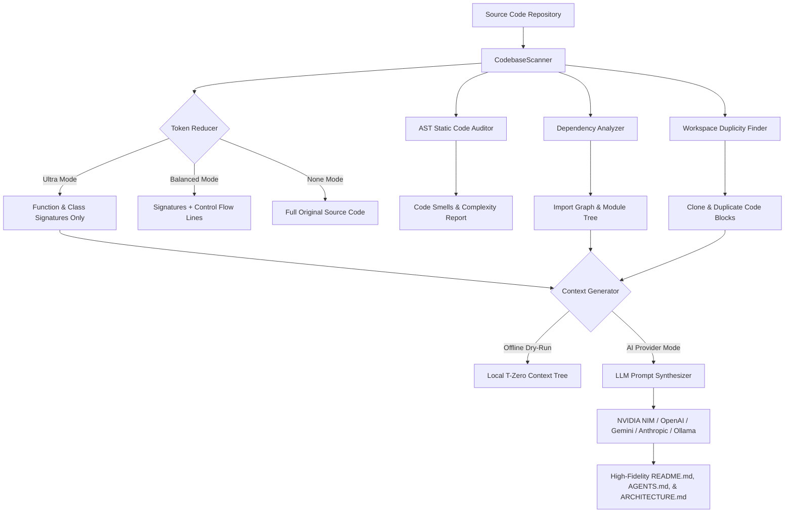
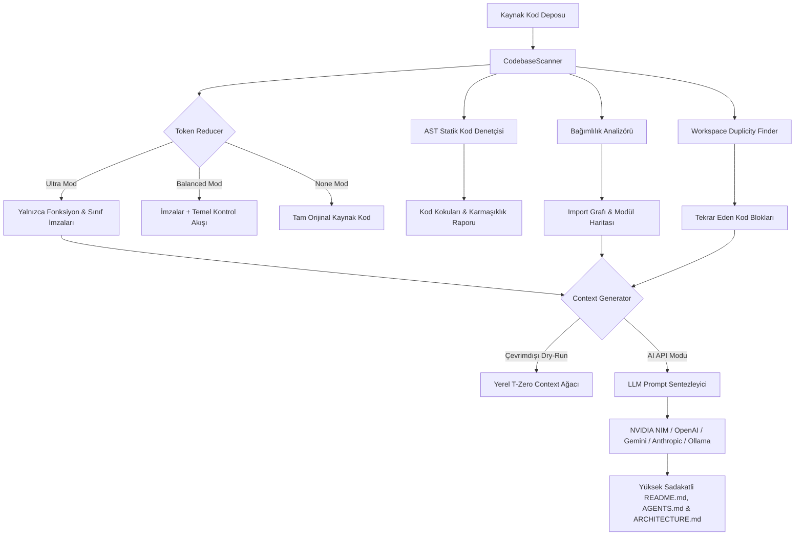

# ⚡ SİBER AKADEMİ — T-ZERO CONTEXT ARCHITECT V3

<p align="center">
  <a href="#-english"><b>🇬🇧 English Documentation</b></a> • 
  <a href="#-türkçe"><b>🇹🇷 Türkçe Dokümantasyon</b></a>
</p>

<p align="center">
  
  
  
  
  
  
</p>

> **Enterprise-Grade Codebase Context Builder, AST Signatures Analyzer, and Token Reducer.**  
> Built for Cursor, VS Code Copilot, Cline, Antigravity IDE, Claude Code, and ChatGPT. Cuts LLM context ingestion overhead by **40% to 95%** while maintaining 100% semantic fidelity.

**Developer:** Toprak Ahmet Aydoğmuş  
**Official Website:** [https://utspro.co](https://utspro.co)  
**Bio & Socials:** [https://hopp.bio/siberegitim](https://hopp.bio/siberegitim)  
**GitHub Repository:** [https://github.com/toprakahmetaydogmus/TZeroAlgorithm](https://github.com/toprakahmetaydogmus/TZeroAlgorithm)

---

# 🇬🇧 English

## Table of Contents
1. [Security Architecture (100% Zero-Leak Guarantee)](#-security-architecture-100-zero-leak-guarantee)
2. [System Architecture](#-system-architecture)
3. [Core Highlights & Capabilities](#-core-highlights--capabilities)
4. [Installation & Setup](#-installation--setup)
5. [Usage Guide (GUI & CLI)](#-usage-guide-gui--cli)
6. [Keyboard Shortcuts](#-keyboard-shortcuts)
7. [Project Structure](#-project-structure)
8. [Automated Test Suite & CI/CD](#-automated-test-suite--cicd)
9. [License & Credits](#-license--credits)

---

## 🔒 Security Architecture (100% Zero-Leak Guarantee)

> [!IMPORTANT]
> **T-Zero Algorithm strictly contains ZERO hardcoded, personal, or public API keys or credentials anywhere in the repository.**  
> Defense-in-depth and zero-trust principles are enforced by default.

1. **OS-Level Credential Encryption (Keyring Engine):**
   - API keys are never written to plain-text configuration files or logs.
   - **Windows:** Windows Credential Manager (`win32cred`)
   - **macOS:** Apple Keychain (`security`)
   - **Linux:** Secret Service API (GNOME Keyring / KWallet via DBus)
2. **Zero Telemetry & Absolute Privacy:**
   - Your source code, tokens, file structure, and API credentials are never sent to any third-party telemetry, analytics, or developer servers.
   - Outbound network traffic is exclusively initiated directly from your client to the AI provider endpoint chosen by you (NVIDIA, OpenAI, Google, Anthropic, OpenRouter, or localhost Ollama).
3. **Encrypted Keyring Backup:**
   - API keys can be securely backed up to an encrypted `.dat` binary archive using salted symmetric XOR encryption with a master password.
4. **12-Factor Environment Variable Detection:**
   - Automatically detects and inherits standard system environment variables when present:
     - `NVIDIA_API_KEY`
     - `OPENAI_API_KEY`
     - `GEMINI_API_KEY`
     - `OPENROUTER_API_KEY`
     - `ANTHROPIC_API_KEY`
5. **100% Offline Dry-Run Mode ($0 Cost):**
   - Generate full-featured context trees, AST signature maps, and markdown blueprints without any internet connection, API keys, or AI provider subscriptions.

---

## 🏗 System Architecture



---

## 🌟 Core Highlights & Capabilities

### 1. Multi-LLM Provider Engine
- **NVIDIA NIM:** `llama-3.3-70b-instruct`, `deepseek-r1`, `mistral-large`, `nemotron-51b`, `qwen3.5`
- **OpenAI:** `gpt-4o`, `gpt-4o-mini`, `o3-mini`, `o1`
- **Google Gemini:** `gemini-2.5-pro`, `gemini-2.5-flash`, `gemini-2.0-flash`
- **Anthropic:** `claude-3-7-sonnet-20250219`, `claude-3-5-sonnet`, `claude-3-5-haiku`
- **OpenRouter:** Universal gateway for `claude-3.7-sonnet`, `gpt-4o`, `deepseek-r1`
- **Local Ollama:** `llama3:latest`, `mistral:latest`, `phi3:latest`, `qwen2.5:latest` (100% local, offline, private, and free)

### 2. AST Token Reducer (Up to 95% Token Savings)
- **Ultra Mode:** Strips implementation internals while preserving class hierarchies, function headers, docstrings, decorators, and type hints.
- **Balanced Mode:** Retains signatures alongside critical control flow and exception handling statements.
- **None Mode:** Preserves 100% of raw source code.
- Supported languages: **Python, JavaScript, TypeScript, JSX/TSX, C/C++, Go, Rust, HTML, CSS, Bash, Batch, JSON, YAML**.

### 3. Advanced Codebase Analysis Tools
- **AST Class & Method Outliner:** Generates a structured hierarchy of every class, method, argument list, and decorator.
- **Static Code Auditor:** Instantly flags missing docstrings, functions exceeding 30 lines, routines with 6+ parameters, and usage of the `global` keyword (supports both synchronous `def` and asynchronous `async def`).
- **Dependency Analyzer:** Scans AST import statements to compile an external and internal module dependency map.
- **Workspace Duplicity Finder:** Identifies identical duplicate blocks of 6+ lines across the entire codebase.
- **AST Refactoring Engine:** Performs safe global function and identifier renames across workspace files using AST node transformation.

### 4. Git VCS Integration & Visual Telemetry
- **Commit History Classifier:** Classifies recent commits automatically (Added, Fixed, Refactored, Updated).
- **Color-Coded Git Diff Viewer:** Displays real-time uncommitted changes (`git diff HEAD`) with syntax highlighting.
- **Integrated Git Manager:** Stage, commit, and switch branches directly from the GUI.
- **Interactive Dependency Node Graph:** Draggable physics-based node visualization of file relationships.
- **Live CPU & RAM Telemetry:** Real-time hardware telemetry monitors system resource overhead.
- **Token Donut Canvas Chart:** Dynamic visual breakdown of file types, code volume, and token consumption.

### 5. Futuristic UI, Dynamic Particle FX & Haptic Audio SFX
- **8 Curated Themes:**
  - 🌌 `Glass Dark` (Frosted cyan accents)
  - ⚡ `Neon Cyberpunk` (Vibrant hot-pink & electric blue)
  - 🖤 `Midnight OLED` (100% pure black #000000 for zero eye strain)
  - 🟢 `Matrix Terminal` (Classic phosphor green #00ff41)
  - 🌆 `Synthwave 80s` (Laser magenta, neon orange, and retro cyan)
  - ❄️ `Nordic Frost` (Arctic slate and glacier blue)
  - ☕ `Solarized Amber` (Warm deep espresso and golden amber)
  - 🕹 `Siber Retro` (Classic hacker aesthetic)
- **4-Mode Dynamic Particle Engine:**
  - 🌌 **Stars:** High-speed 3D depth-warping starfield.
  - 🟢 **Matrix Rain:** Digital cascading green code glyphs.
  - 🌐 **Cyber Grid:** Retro-perspective horizon wireframe wave.
  - ⬛ **Solid Minimal:** Distraction-free dark canvas with 0% CPU consumption.
- **Haptic SFX Engine:** Non-blocking auditory feedback for actions (scans, copies, exports, errors) with an instant header toggle (`🔊 SFX ON` / `🔇 SFX OFF`).
- **Floating Cyberpunk Toasts:** Non-intrusive status banners that inform you of saves and exports without interrupting workflow.

### 6. Multi-Format Context Export Hub
- **`README.md`:** Comprehensive architectural documentation.
- **`AGENTS.md` / `CLAUDE.md`:** Specially structured context blueprint for AI coding assistants (Cursor, Antigravity IDE, Claude Code, Cline, Copilot) containing architecture rules, AST summaries, and workspace conventions.
- **`ARCHITECTURE.md`:** System architecture blueprint with auto-generated Mermaid topology diagrams.
- **`REPO_MAP.txt`:** Highly compressed AST symbol token map tailored for pasting directly into LLM chat prompts.
- **`README.html`:** Styled cyberpunk dark-mode HTML documentation that launches in your default web browser with one click.
- **Live Token Budget & USD Cost Estimator:** Real-time token counter and estimated API cost per model (OpenAI, Claude, Groq, NVIDIA NIM, Ollama).

---

## 📦 Installation & Setup

### Method 1: One-Click Installer (Recommended for Windows)
```cmd
install_requirements.bat
```
> Automatically provisions Python 3.12 (if not detected), configures a virtual environment, and installs all dependencies without requiring manual setup.

### Method 2: Standalone Portable Executable (.exe)
Download `TZeroAlgorithm.exe` directly from the [Releases](https://github.com/toprakahmetaydogmus/TZeroAlgorithm/releases) tab. No installation, Python, or administrative rights required.

### Method 3: Python Package / pip Installation
```bash
# Clone repository
git clone https://github.com/toprakahmetaydogmus/TZeroAlgorithm.git
cd TZeroAlgorithm

# Install dependencies
pip install -r requirements.txt

# Or install in editable development mode
pip install -e .
```

---

## 🎮 Usage Guide (GUI & CLI)

### 1. Graphical User Interface (GUI)
```bash
# Launch via Python
python main.py

# Or launch via Windows batch script
run.bat

# Or launch via legacy wrapper
python tzero.py
```

### 2. Command Line Interface (CLI)
T-Zero V3 offers a full suite of CLI flags for terminal enthusiasts and automated CI/CD pipelines:

```bash
# 1. Scan directory and print metric table
python main.py --scan .

# 2. Audit codebase quality and detect code smells
python main.py --audit .

# 3. Generate offline context tree locally ($0 API cost)
python main.py --dry-run --dir . --output README.md

# 4. Generate AI Agent Rules & Blueprint (AGENTS.md / CLAUDE.md)
python main.py --export-agents AGENTS.md --dir .

# 5. Generate System Architecture Specification (ARCHITECTURE.md)
python main.py --export-arch ARCHITECTURE.md --dir .

# 6. Generate Compressed Token Symbol Map (REPO_MAP.txt)
python main.py --export-repomap REPO_MAP.txt --dir .

# 7. Generate Cyberpunk Styled HTML Preview (README.html)
python main.py --export-html README.html --dir .

# 8. Launch Interactive Terminal Wizard
python main.py --cli

# 9. Print current engine version
python main.py --version
```

---

## ⌨️ Keyboard Shortcuts

| Shortcut | Action |
|----------|--------|
| `Ctrl+S` | Scan Active Workspace Directory |
| `Ctrl+G` | Generate / Compile Context Tree |
| `Ctrl+C` | Copy Generated Context to Clipboard |
| `Ctrl+R` | Refresh Git Log & Branches |

---

## 📂 Project Structure

```
TZeroAlgorithm/
├── .github/
│   └── workflows/
│       └── ci.yml               # Automated GitHub Actions test workflow
├── tests/
│   ├── __init__.py
│   ├── test_analyzer.py         # AST analysis and code smell unit tests
│   ├── test_cli.py              # CLI integration tests
│   ├── test_config.py           # Configuration & Keyring security tests
│   ├── test_exports.py          # Multi-format exports & token cost tests
│   ├── test_generator.py        # Template engine & context generator tests
│   ├── test_gui.py              # Tkinter GUI headless smoke tests
│   ├── test_providers.py        # Multi-provider LLM adapter tests
│   └── test_scanner.py          # TokenReducer & CodebaseScanner tests
├── build_exe.bat                # One-click Windows PyInstaller build script
├── compile.py                   # PyInstaller asset packaging pipeline
├── install_requirements.bat     # Windows automated setup script
├── LICENSE                      # MIT Open Source License
├── main.py                      # Primary execution entrypoint (CLI & GUI)
├── pyproject.toml               # Modern PEP 517/621 packaging metadata
├── README.md                    # Bilingual comprehensive documentation
├── requirements.txt             # Production Python dependencies
├── run.bat                      # Windows quick-launch runner
├── siber_akademi.ico            # High-resolution application icon
├── tzero.py                     # Backward-compatibility execution wrapper
├── tzero_v3.py                  # Monolithic portable T-Zero V3 core engine
└── WALKTHROUGH.md               # Technical architecture walkthrough
```

---

## 🧪 Automated Test Suite & CI/CD

Run all unit and integration tests locally:

```bash
python -m unittest discover -s tests -v
```

Expected output:
```
Ran 34 tests in ~3.2s
OK (100% Pass)
```

GitHub Actions automatically runs this test suite on every push and pull request across Ubuntu and Windows runners under Python 3.10, 3.11, and 3.12.

---

## 📄 License & Credits

This project is licensed under the **MIT License**. See the [LICENSE](LICENSE) file for complete terms.

**Toprak Ahmet Aydoğmuş** — Siber Akademi  
- 🌐 **Website:** [utspro.co](https://utspro.co)  
- 🔗 **Links & Socials:** [hopp.bio/siberegitim](https://hopp.bio/siberegitim)  
- 🐙 **GitHub:** [@toprakahmetaydogmus](https://github.com/toprakahmetaydogmus)

---
---

# 🇹🇷 Türkçe

## İçindekiler
1. [Şifreli Güvenlik Mimarisi (%100 Zero-Leak Garantisi)](#-şifreli-güvenlik-mimarisi-100-zero-leak-garantisi)
2. [Sistem Mimarisi](#-sistem-mimarisi-1)
3. [Öne Çıkan Yetenekler & Özellikler](#-öne-çıkan-yetenekler--özellikler)
4. [Kurulum ve Başlangıç](#-kurulum-ve-başlangıç)
5. [Kullanım Kılavuzu (GUI & CLI)](#-kullanım-kılavuzu-gui--cli)
6. [Klavye Kısayolları](#-klavye-kısayolları)
7. [Proje Dizin Ağacı](#-proje-dizin-ağacı)
8. [Otomatik Test Süreci ve CI/CD](#-otomatik-test-süreci-ve-cicd)
9. [Lisans ve Geliştirici Bilgileri](#-lisans-ve-geliştirici-bilgileri)

---

## 🔒 Şifreli Güvenlik Mimarisi (%100 Zero-Leak Garantisi)

> [!IMPORTANT]
> **T-Zero Algorithm, kod tabanında kesinlikle sabit kodlanmış (hardcoded), şahsi veya umumi hiçbir API anahtarı veya kimlik bilgisi barındırmaz.**  
> Uygulama varsayılan olarak sıfır güven (zero-trust) ve askeri düzeyde yerel şifreleme ilkelerini uygular.

1. **İşletim Sistemi Düzeyinde Kimlik Şifreleme (OS Keyring Motoru):**
   - API anahtarları asla düz metin dosyalarında (`.env`, `.json`, `.txt`) veya loglarda saklanmaz.
   - **Windows:** Windows Credential Manager (`win32cred`)
   - **macOS:** Apple Keychain (`security`)
   - **Linux:** Secret Service API (GNOME Keyring / KWallet - DBus üzerinden)
2. **Sıfır Telemetri ve Tam Veri Gizliliği:**
   - Kaynak kodlarınız, token verileriniz, dosya hiyerarşiniz veya API anahtarlarınız asla üçüncü taraf telemetri, analitik veya geliştirici sunucularına iletilmez.
   - Tüm giden ağ trafiği yalnızca sizin belirlediğiniz AI sağlayıcısının (NVIDIA, OpenAI, Google, Anthropic, OpenRouter veya yerel Ollama) resmi uç noktasına doğrudan HTTPS üzerinden gerçekleştirilir.
3. **Şifreli Yerel Yedekleme (Encrypted Keyring Backup):**
   - API anahtarlarınızı taşımak veya yedeklemek istediğinizde, kullanıcı tanımlı bir ana parola ile tuzlanmış (salted) simetrik XOR şifreleme uygulanarak ikili `.dat` dosyası oluşturulur.
4. **12-Factor Sistem Ortam Değişkeni Desteği:**
   - Sisteminizde tanımlı olan çevre değişkenlerini otomatik olarak algılar ve kullanıma sunar:
     - `NVIDIA_API_KEY`
     - `OPENAI_API_KEY`
     - `GEMINI_API_KEY`
     - `OPENROUTER_API_KEY`
     - `ANTHROPIC_API_KEY`
5. **%100 Çevrimdışı (Offline Dry-Run) Modu (0 TL Maliyet):**
   - Hiçbir API anahtarına, internet bağlantısına veya yapay zeka aboneliğine gerek kalmadan, tamamen yerel makinenizde tam kapsamlı context ağaçları, AST imza haritaları ve doküman taslakları oluşturabilirsiniz.

---

## 🏗 Sistem Mimarisi



---

## 🌟 Öne Çıkan Yetenekler & Özellikler

### 1. Çoklu LLM Sağlayıcı Entegrasyonu
- **NVIDIA NIM:** `llama-3.3-70b-instruct`, `deepseek-r1`, `mistral-large`, `nemotron-51b`, `qwen3.5`
- **OpenAI:** `gpt-4o`, `gpt-4o-mini`, `o3-mini`, `o1`
- **Google Gemini:** `gemini-2.5-pro`, `gemini-2.5-flash`, `gemini-2.0-flash`
- **Anthropic:** `claude-3-7-sonnet-20250219`, `claude-3-5-sonnet`, `claude-3-5-haiku`
- **OpenRouter:** `claude-3.7-sonnet`, `gpt-4o`, `deepseek-r1` için evrensel ağ geçidi
- **Local Ollama:** `llama3:latest`, `mistral:latest`, `phi3:latest`, `qwen2.5:latest` (%100 yerel, çevrimdışı, gizli ve ücretsiz)

### 2. Akıllı AST Token İndirgeyici (%95'e Varan Tasarruf)
- **Ultra Mod:** Fonksiyon gövdelerini temizler; sınıf hiyerarşisini, fonksiyon başlıklarını, docstring'leri, dekoratörleri ve tip ipuçlarını korur.
- **Balanced Mod:** İmzalarla birlikte temel kontrol bloklarını (if/try/for) ve istisna yönetimini muhafaza eder.
- **None Mod:** Kaynak kodun %100 orijinal halini korur.
- Desteklenen diller: **Python, JavaScript, TypeScript, JSX/TSX, C/C++, Go, Rust, HTML, CSS, Bash, Batch, JSON, YAML**.

### 3. İleri Düzey Kod Tabanı Analiz Araçları
- **AST Sınıf ve Metot Ağacı:** Tüm sınıfları, metotları, argüman listelerini ve dekoratörleri hiyerarşik olarak listeler.
- **Statik Kod Denetçisi (Static Code Auditor):** Eksik docstring'leri, 30 satırı aşan aşırı karmaşık rutinleri, 6 ve üzeri parametre alan fonksiyonları ve `global` anahtar kelimesi kullanımını anında tespit eder (hem senkron `def` hem asenkron `async def` desteklenir).
- **Bağımlılık Analizi (Dependency Analyzer):** AST import düğümlerini inceleyerek projenin iç ve dış modül haritasını çıkarır.
- **Tekrar Kod Bulucu (Duplicity Finder):** Çalışma alanı genelinde 6+ satırlık kopya kod bloklarını tespit eder.
- **AST Refactoring Motoru:** Güvenli AST dönüşümü kullanarak proje genelinde fonksiyon ve değişken isimlerini otomatik olarak refactor eder.

### 4. Git Sürüm Kontrolü ve Canlı Görsel Telemetri
- **Commit Geçmişi Sınıflandırıcı:** Son commit'leri otomatik etiketler (Added, Fixed, Refactored, Updated).
- **Canlı Renkli Git Diff:** Kaydedilmemiş değişiklikleri (`git diff HEAD`) sözdizimi renklendirmesiyle gösterir.
- **Entegre Git Yöneticisi:** GUI üzerinden stage, commit ve dal (branch) değiştirme işlemleri.
- **İnteraktif Bağımlılık Grafı:** Dosyalar arasındaki ilişkiyi sürükle-bırak destekli fiziksel düğüm grafiği olarak çizer.
- **Canlı CPU ve RAM Telemetrisi:** Sistem kaynak kullanımını gerçek zamanlı takip eder.
- **Token Donut Grafiği:** Dosya türü dağılımını, hacmini ve token tüketimini dinamik kanvas üzerinde çizer.

### 5. Fütüristik GUI, Dinamik Parçacık Animasyonları & Haptik Sesler
- **8 Özel Tema:**
  - 🌌 `Glass Dark` (Buzlu cam ve camgöbeği vurgular)
  - ⚡ `Neon Cyberpunk` (Canlı fuşya ve elektrik mavisi)
  - 🖤 `Midnight OLED` (Sıfır göz yorgunluğu için %100 saf siyah #000000)
  - 🟢 `Matrix Terminal` (Klasik fosforlu hacker yeşili #00ff41)
  - 🌆 `Synthwave 80s` (Lazer macenta, neon turuncu ve retro mavi)
  - ❄️ `Nordic Frost` (Kutup grisi ve buzul mavisi)
  - ☕ `Solarized Amber` (Derin espresso ve sıcak amber)
  - 🕹 `Siber Retro` (Klasik Siber Akademi teması)
- **4-Modlu Dinamik Parçacık FX Motoru:**
  - 🌌 **Stars:** 3D derinlik algılı ve değişken hızlı yıldız tüneli.
  - 🟢 **Matrix Rain:** Dijital aşağı kayan yeşil kod ve karakter yağmuru.
  - 🌐 **Cyber Grid:** Ufuk çizgisine uzanan perspektif tel örgü dalgası.
  - ⬛ **Solid Minimal:** Sıfır CPU tüketimiyle saf minimal koyu zemin.
- **Haptik Ses Motoru (SFX):** Tıklamalar, tarama tamamlanması ve bağlam üretiminde sesli geri bildirim sağlar (`winsound.Beep` arka planda çalışır, arayüzü asla dondurmaz; başlık çubuğundan tek tıkla `🔊 SFX ON` / `🔇 SFX OFF` yapılabilir).
- **Yüzen Cyberpunk Toast Bildirimleri:** Panoya kopyalama ve kaydetme işlemlerinde kullanıcıyı rahatsız etmeden yumuşak bildirimler gösterir.

### 6. Çoklu Format Dışa Aktarma Paketi (Context Architect Hub)
- **`README.md`:** Ayrıntılı depo ve mimari dokümantasyonu.
- **`AGENTS.md` / `CLAUDE.md`:** Cursor, Antigravity IDE, Claude Code, Cline ve Copilot gibi yapay zeka kodlama ajanları için özel yapılandırılmış sistem ve kural rehberi.
- **`ARCHITECTURE.md`:** Otomatik üretilen Mermaid şeması ve modül bağımlılık hiyerarşisi içeren mimari spesifikasyonu.
- **`REPO_MAP.txt`:** LLM sohbet pencerelerine doğrudan yapıştırılmak üzere aşırı sıkıştırılmış AST simge haritası.
- **`README.html`:** Cyberpunk koyu temalı, tarayıcıda tek tıkla açılan görsel HTML önizlemesi.
- **Canlı Token Bütçesi ve USD Maliyet Hesaplayıcı:** Gerçek zamanlı token sayımı ve seçilen modele göre tahmini API harcama maliyeti.

---

## 📦 Kurulum ve Başlangıç

### Yöntem 1: Tek Tıkla Kurulum (.bat) — Windows İçin Önerilen
```cmd
install_requirements.bat
```
> Sisteminizde Python bulunmasa bile Python 3.12'yi otomatik indirir, sanal ortamı kurar ve tüm paketleri eksiksiz yapılandırır.

### Yöntem 2: Bağımsız Çalıştırılabilir Dosya (.exe)
Releases bölümünden `TZeroAlgorithm.exe` dosyasını indirin. Kurulum, Python veya yönetici yetkisi gerektirmeden çift tıklayarak çalıştırın.

### Yöntem 3: Python Paketi / pip ile Kurulum
```bash
# Depoyu klonlayın
git clone https://github.com/toprakahmetaydogmus/TZeroAlgorithm.git
cd TZeroAlgorithm

# Bağımlılıkları yükleyin
pip install -r requirements.txt

# Veya geliştirici modunda kurun
pip install -e .
```

---

## 🎮 Kullanım Kılavuzu (GUI & CLI)

### 1. Grafiksel Kullanıcı Arayüzü (GUI)
```bash
# Python ile çalıştırma
python main.py

# Veya Windows başlatıcı betiği ile
run.bat

# Veya uyumluluk sarmalayıcısı ile
python tzero.py
```

### 2. Komut Satırı Arayüzü (CLI)
Terminal geliştiricileri ve CI/CD otomasyonları için gelişmiş komut satırı bayrakları:

```bash
# 1. Projeyi tara ve metrik tablosunu ekrana bas
python main.py --scan .

# 2. Kod kalitesini denetle ve code smell raporu al
python main.py --audit .

# 3. Sıfır API maliyetiyle yerel çevrimdışı context ağacı üret
python main.py --dry-run --dir . --output README.md

# 4. Yapay Zeka Ajan Kılavuzu (AGENTS.md / CLAUDE.md) üret
python main.py --export-agents AGENTS.md --dir .

# 5. Mermaid Mimari Şeması (ARCHITECTURE.md) üret
python main.py --export-arch ARCHITECTURE.md --dir .

# 6. Sıkıştırılmış Token Repo Haritası (REPO_MAP.txt) üret
python main.py --export-repomap REPO_MAP.txt --dir .

# 7. Koyu Modlu Görsel HTML Önizlemesi (README.html) üret
python main.py --export-html README.html --dir .

# 8. İnteraktif Terminal Sihirbazını başlat
python main.py --cli

# 9. Sürüm bilgisini görüntüle
python main.py --version
```

---

## ⌨️ Klavye Kısayolları

| Kısayol | Eylem |
|---------|-------|
| `Ctrl+S` | Seçili Çalışma Alanını Tara |
| `Ctrl+G` | Context Ağacını Derle / Üret |
| `Ctrl+C` | Üretilen İçeriği Panoya Kopyala |
| `Ctrl+R` | Git Geçmişini ve Dalları Yenile |

---

## 📂 Proje Dizin Ağacı

```
TZeroAlgorithm/
├── .github/
│   └── workflows/
│       └── ci.yml               # GitHub Actions CI/CD otomatik test boru hattı
├── tests/
│   ├── __init__.py
│   ├── test_analyzer.py         # AST analiz ve denetim testleri
│   ├── test_cli.py              # CLI komut satırı entegrasyon testleri
│   ├── test_config.py           # Config ve Keyring güvenlik testleri
│   ├── test_exports.py          # Çoklu format dışa aktarım & maliyet testleri
│   ├── test_generator.py        # Şablon motoru ve bağlam derleme testleri
│   ├── test_gui.py              # Tkinter GUI başlatma testleri
│   ├── test_providers.py        # 6 AI sağlayıcı adaptör testleri
│   └── test_scanner.py          # TokenReducer ve CodebaseScanner testleri
├── build_exe.bat                # Windows PyInstaller tek tık derleme betiği
├── compile.py                   # PyInstaller asset paketleme boru hattı
├── install_requirements.bat     # Windows otomatik ortam kurulum betiği
├── LICENSE                      # MIT Açık Kaynak Lisansı
├── main.py                      # Ana çalıştırma giriş noktası (CLI & GUI)
├── pyproject.toml               # Modern PEP 517/621 paket yapılandırması
├── README.md                    # İki dilli kapsamlı dokümantasyon
├── requirements.txt             # Üretim bağımlılık listesi
├── run.bat                      # Windows hızlı başlatıcısı
├── siber_akademi.ico            # Yüksek çözünürlüklü uygulama ikonu
├── tzero.py                     # Geriye dönük uyumluluk wrapper'ı
├── tzero_v3.py                  # Bağımsız taşınabilir T-Zero V3 motoru
└── WALKTHROUGH.md               # Detaylı teknik mimari kılavuzu
```

---

## 🧪 Otomatik Test Süreci ve CI/CD

Bütün birim ve entegrasyon testlerini yerel olarak çalıştırmak için:

```bash
python -m unittest discover -s tests -v
```

Beklenen çıktı:
```
Ran 34 tests in ~3.2s
OK (100% Pass)
```

GitHub Actions, depoya yapılan her push ve pull request işleminde Ubuntu ve Windows ortamlarında Python 3.10, 3.11 ve 3.12 ile bu testleri otomatik olarak yürütür.

---

## 📄 Lisans ve Geliştirici Bilgileri

Bu proje **MIT Lisansı** altında lisanslanmıştır. Detaylar için [LICENSE](LICENSE) dosyasına bakabilirsiniz.

**Toprak Ahmet Aydoğmuş** — Siber Akademi  
- 🌐 **Web Sitesi:** [utspro.co](https://utspro.co)  
- 🔗 **Bağlantılar & Sosyal:** [hopp.bio/siberegitim](https://hopp.bio/siberegitim)  
- 🐙 **GitHub:** [@toprakahmetaydogmus](https://github.com/toprakahmetaydogmus)
