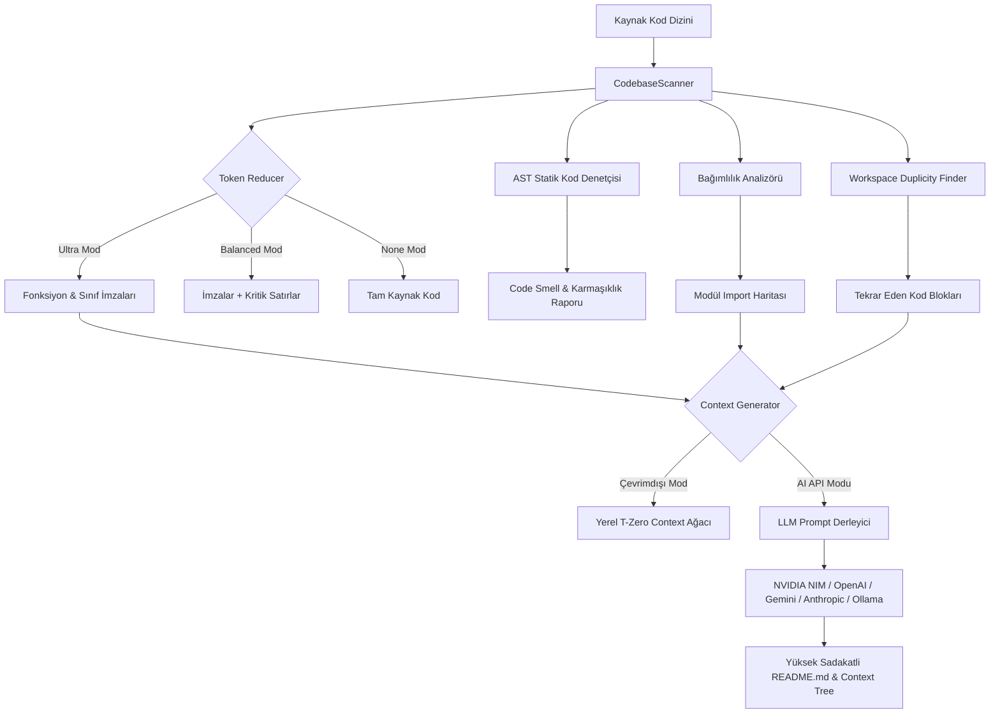

# ⚡ SİBER AKADEMİ — T-ZERO CONTEXT ARCHITECT V3

[](https://github.com/toprakahmetaydogmus/TZeroAlgorithm/releases)
[](https://github.com/toprakahmetaydogmus/TZeroAlgorithm#-%C5%9Fifreli-g%C3%BCvenlik-mimarisi-100-zero-leak)
[](https://python.org)
[](LICENSE)
[](https://github.com/toprakahmetaydogmus/TZeroAlgorithm)

> **Enterprise-Grade Codebase Context Builder, AST Signatures Analyzer, and Token Reducer.**  
> Built for Cursor, VS Code Copilot, Cline, Antigravity IDE, Claude, and ChatGPT. Cuts LLM context ingestion overhead by **40% to 95%** while maintaining 100% semantic fidelity.

**Geliştirici:** Toprak Ahmet Aydoğmuş  
**Resmi Web Sitesi:** [https://utspro.co](https://utspro.co)  
**Biyografi & Bağlantılar:** [https://hopp.bio/siberegitim](https://hopp.bio/siberegitim)

---

## 🔒 Şifreli Güvenlik Mimarisi (%100 Zero-Leak)

> [!IMPORTANT]
> **T-Zero Algorithm, kod tabanında kesinlikle sabit kodlanmış (hardcoded), kişisel veya genel API anahtarı barındırmaz.**  
> Uygulama askeri düzeyde güvenliği varsayılan olarak benimser.

1. **İşletim Sistemi Seviyesinde Şifreleme (OS Keyring):**
   - API anahtarları asla düz metin dosyalarında saklanmaz.
   - **Windows:** Windows Credential Manager
   - **macOS:** Apple Keychain
   - **Linux:** Secret Service API (GNOME Keyring / KWallet)
2. **Sıfır Telemetri ve Veri Sızıntısı:**
   - Kod tabanınız ve API anahtarlarınız asla üçüncü taraf sunuculara veya geliştirici sunucularına gönderilmez.
   - Yalnızca sizin seçtiğiniz AI sağlayıcısına (NVIDIA, OpenAI, Google, Anthropic vb.) doğrudan HTTPS bağlantısı kurulur.
3. **Şifreli Yerel Yedekleme (Encrypted Keyring Backup):**
   - API anahtarlarınızı yedeklerken kullanıcı tanımlı anahtar ile simetrik XOR şifreleme uygulanır (`.dat` ikili formatında).
4. **Çevresel Değişken (12-Factor Env) Desteği:**
   - Sistem ortam değişkenlerini otomatik algılar:
     - `NVIDIA_API_KEY`
     - `OPENAI_API_KEY`
     - `GEMINI_API_KEY`
     - `OPENROUTER_API_KEY`
     - `ANTHROPIC_API_KEY`
5. **Tam Çevrimdışı (Offline Dry-Run) Modu:**
   - Herhangi bir AI sağlayıcısına veya API anahtarına ihtiyaç duymadan, %100 yerel ve ücretsiz olarak tam kapsamlı context ağacı üretir.

---

## 🏗 Sistem Mimarisi



---

## 🌟 Öne Çıkan Özellikler

### 1. Çoklu AI Sağlayıcı Entegrasyonu
- **NVIDIA NIM:** `llama-3.3-70b-instruct`, `deepseek-r1`, `mistral-large`, `nemotron-51b`, `qwen3.5`
- **OpenAI:** `gpt-4o`, `gpt-4o-mini`, `o3-mini`, `o1`
- **Google Gemini:** `gemini-2.5-pro`, `gemini-2.5-flash`, `gemini-2.0-flash`
- **Anthropic:** `claude-3-7-sonnet-20250219`, `claude-3-5-sonnet`, `claude-3-5-haiku`
- **OpenRouter:** `claude-3.7-sonnet`, `gpt-4o`, `deepseek-r1`
- **Local Ollama:** `llama3:latest`, `mistral:latest`, `phi3:latest`, `qwen2.5:latest` (%100 yerel ve ücretsiz)

### 2. Akıllı AST Token İndirgeme (TokenReducer)
- **Ultra Mod:** Yalnızca fonksiyon başlıkları, sınıflar, dekoratörler ve import bildirimlerini tutar; fonksiyon gövdelerini akıllıca budar.
- **Balanced Mod:** İmzalarla birlikte temel mantık akışını korur.
- **None Mod:** Kodun orijinal halini korur.
- Desteklenen diller: **Python, JavaScript, TypeScript, JSX/TSX, C/C++, Go, Rust, HTML, CSS, Bash, Batch, JSON, YAML**.

### 3. Gelişmiş Kod Analiz Araçları
- **AST Yapı Tarayıcısı:** Sınıf hiyerarşisi, metotlar ve parametre listesini ağaç şeklinde çıkarır.
- **Statik Kod Denetçisi (Static Code Auditor):** Eksik docstring, 30+ satırlık aşırı karmaşık fonksiyonlar, 6+ argüman kabul eden fonksiyonlar ve `global` anahtar kelimesi kullanımlarını anında tespit eder (hem senkron hem `async def` destekli).
- **Bağımlılık Analizi (Dependency Analyzer):** AST import düğümlerini tarayarak projenin harici bağımlılık haritasını çıkarır.
- **Tekrar Kod Bulucu (Duplicity Finder):** Workspace genelinde 6+ satırlık kopya/tekrar kod bloklarını tespit eder.
- **AST Refactoring Engine:** Proje genelinde fonksiyon ve değişken isimlerini güvenli AST dönüşümüyle refactor eder.

### 4. Git Entegrasyonu & Görselleştirme
- **Commit Geçmişi Analizi:** Son 15 commit'i otomatik sınıflandırır (Added, Fixed, Updated).
- **Canlı Git Diff Görüntüleyici:** `git diff HEAD` çıktısını renk kodlu olarak gösterir.
- **Dahili Git Commit & Branch Yöneticisi:** GUI üzerinden stage, commit ve branch değiştirme.
- **İnteraktif Node Grafı:** Dosyalar arasındaki ilişki ağını sürükle-bırak destekli görselleştirir.
- **Canlı CPU/RAM Telemetrisi:** Sistem kaynak kullanımını gerçek zamanlı izler.
- **Token Donut Grafiği & Dil Dağılım Matrisi:** Dosya türü ve boyut dağılımını dinamik Canvas üzerinde çizer.

### 5. Gelişmiş GUI & Pygments Syntax Highlighting
- **3 Ultra-Lüks Tema:** Glass Dark, Siber Retro, Neon Cyberpunk.
- **Pygments Sözdizimi Vurgulayıcı:** Dahili bölünmüş editörde kodları renklendirir.
- **Çift Dilli Destek:** Türkçe ve İngilizce tam arayüz çevirisi.

---

## 📦 Kurulum

### Yöntem 1: Tek Tıkla Kurulum (.bat) — Önerilen (Windows)
```cmd
install_requirements.bat
```
> Sisteminizde Python bulunmasa dahi otomatik olarak Python 3.12 ve tüm bağımlılıkları indirip yapılandırır.

### Yöntem 2: Standalone .EXE (Doğrudan Çalıştırılabilir)
Releases sayfasından derlenmiş `TZeroAlgorithm.exe` dosyasını indirin. Kurulum veya Python gerektirmez; çift tıklayarak doğrudan çalıştırın.

### Yöntem 3: Python Paketi / pip ile Kurulum
```bash
# Depoyu klonlayın
git clone https://github.com/toprakahmetaydogmus/TZeroAlgorithm.git
cd TZeroAlgorithm

# Bağımlılıkları yükleyin
pip install -r requirements.txt

# Veya paketi geliştirici modunda kurun
pip install -e .
```

---

## 🎮 Kullanım Rehberi

### 1. Grafiksel Kullanıcı Arayüzü (GUI)
```bash
# Python ile başlatma
python main.py

# Veya run.bat ile çift tıkla başlatma
run.bat

# Veya tzero.py geriye dönük uyumluluk wrapper'ı ile
python tzero.py
```

### 2. Komut Satırı Arayüzü (CLI)

T-Zero V3, CI/CD ve terminal geliştiricileri için zengin bir CLI arayüzü sunar:

```bash
# 1. Projeyi tara ve metrik tablosunu görüntüle
python main.py --scan .

# 2. Kod kalitesini ve code smell sorunlarını denetle
python main.py --audit .

# 3. Sıfır API maliyetiyle yerel olarak çevrimdışı context ağacı üret (Offline Dry-Run)
python main.py --dry-run --dir . --output README.md

# 4. İnteraktif Terminal Sihirbazını başlat
python main.py --cli

# 5. Belirli bir sağlayıcı ve model ile üretim yap
python main.py --cli --provider "OpenAI"

# 6. Sürüm bilgisini kontrol et
python main.py --version
```

### Klavye Kısayolları (GUI İçinde)
| Kısayol | İşlev |
|---------|-------|
| `Ctrl+S` | Çalışma alanını anında tara |
| `Ctrl+G` | Context ağacını derle / üret |
| `Ctrl+C` | Üretilen context içeriğini panoya kopyala |
| `Ctrl+R` | Git commit geçmişini yenile |

---

## 📂 Proje Dizin Yapısı

```
TZeroAlgorithm/
├── .github/
│   └── workflows/
│       └── ci.yml               # Otomatik GitHub Actions test akışı
├── tests/
│   ├── __init__.py
│   ├── test_analyzer.py         # AST analiz ve denetim birim testleri
│   ├── test_cli.py              # CLI komut satırı entegrasyon testleri
│   ├── test_config.py           # Config ve Keyring güvenlik testleri
│   ├── test_generator.py        # Şablon ve context üretim testleri
│   ├── test_providers.py        # 6 AI sağlayıcı adaptör testleri
│   └── test_scanner.py          # TokenReducer ve CodebaseScanner testleri
├── build_exe.bat                # Windows PyInstaller tek tık derleme betiği
├── compile.py                   # Gelişmiş PyInstaller derleme boru hattı
├── install_requirements.bat     # Otomatik Python ve paket kurulum betiği
├── LICENSE                      # MIT Açık Kaynak Lisansı
├── main.py                      # Ana çalıştırma giriş noktası (CLI & GUI)
├── pyproject.toml               # Modern PEP 517/621 paket yapılandırması
├── README.md                    # Proje dokümantasyonu
├── requirements.txt             # Python bağımlılık listesi
├── run.bat                      # Hızlı başlatma başlatıcısı
├── siber_akademi.ico            # Yüksek çözünürlüklü uygulama ikonu
├── tzero.py                     # Geriye dönük uyumluluk wrapper'ı
├── tzero_v3.py                  # Kapsamlı T-Zero V3 motoru (tek dosya taşınabilir)
└── WALKTHROUGH.md               # Detaylı mimari ve geliştirici yürüyüşü
```

---

## 🧪 Testler

Tüm birim ve entegrasyon testlerini çalıştırmak için:

```bash
python -m unittest discover -s tests -v
```

Çıktı özeti:
```
Ran 28 tests in 2.4s
OK (100% Pass)
```

---

## 📄 Lisans

Bu proje **MIT Lisansı** altında lisanslanmıştır. Detaylar için [LICENSE](LICENSE) dosyasına göz atabilirsiniz.

---

## 👨‍💻 Geliştirici & İletişim

**Toprak Ahmet Aydoğmuş** — Siber Akademi  
- 🌐 **Ana Site:** [utspro.co](https://utspro.co)  
- 🔗 **Biyografi & Sosyal Medya:** [hopp.bio/siberegitim](https://hopp.bio/siberegitim)  
- 🐙 **GitHub:** [@toprakahmetaydogmus](https://github.com/toprakahmetaydogmus)
