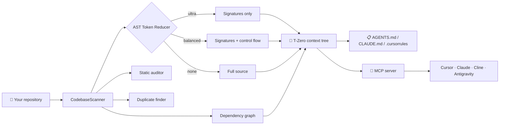

<div align="center">

# ⚡ T-ZERO

### Stop feeding your AI the whole codebase.

**Give Cursor, Claude, Copilot, Cline & friends the *map* — not the whole territory.**
T-Zero compresses a repository into a hierarchical, AST-accurate context that cuts LLM token usage by **up to 95%** — fully offline, with zero telemetry and zero hardcoded secrets.

<br/>


<br/><br/>

[**Quick start**](#-quick-start-in-60-seconds) ·
[**How it works**](#-how-it-works) ·
[**MCP server**](#-mcp-server-your-agent-gets-superpowers) ·
[**CLI**](#-cli-cheat-sheet) ·
[**Security**](#-security-by-design) ·
[**Install**](#-installation)

</div>

---

## 🧠 The problem

Every time you ask an AI assistant about your code, you pay for the same wasteful ritual: paste files, burn tokens, hit the context limit, watch the model lose the plot.

Most of what you paste is *implementation detail the model doesn't need* to understand your architecture. What it needs is the **shape** of the system: what exists, how it connects, and where the boundaries are.

**T-Zero builds exactly that.**

| | Pasting raw source | With T-Zero |
|:--|:--|:--|
| **Tokens per question** | Entire files, every time | Signatures, structure and dependencies only |
| **Architecture awareness** | Whatever fits in the window | Full repo map, always |
| **Privacy** | Depends on the tool | 100% local, offline by default |
| **Cost** | Grows with repo size | Up to **95% lower** |
| **Setup** | — | `pip install` and one command |

---

## 🚀 Quick start in 60 seconds

```bash
git clone https://github.com/toprakahmetaydogmus/TZeroAlgorithm.git
cd TZeroAlgorithm
pip install -r requirements.txt

# 1. See what your repo costs in tokens
python main.py --scan .

# 2. Build a compressed context tree. Offline, no API key, $0
python main.py --dry-run --dir . --output CONTEXT.md

# 3. Plug it into your AI agent through MCP
python main.py --mcp
```

That's it. No account, no API key, no network.

---

## 🔬 How it works

T-Zero parses your code into an AST and keeps what an LLM needs to *reason* about it, dropping what it doesn't.



### The T-tier context model

Context is layered so an agent can start broad and zoom in only where it needs to.

| Tier | Name | What the agent gets |
|:--:|:--|:--|
| **T-1** | Master Architecture | The big picture: components and how they fit together |
| **T-2** | Module References | Per-module summaries and relationships |
| **T-3** | AST Signatures | Classes, functions, arguments, decorators, type hints, docstrings |
| **T-4** | Agent Boundaries | Rules of the road: layering constraints and conventions the agent must respect |

### Three reduction modes

| Mode | Keeps | Best for |
|:--|:--|:--|
| `ultra` | Class hierarchy, function headers, docstrings, decorators, type hints | Maximum savings, architecture questions |
| `balanced` | Everything in `ultra`, plus control flow and exception handling | Debugging and code review |
| `none` | 100% of the original source | When the model must see every line |

**Supported languages:** Python, JavaScript, TypeScript, JSX/TSX, C/C++, Go, Rust, HTML, CSS, Bash, Batch, JSON, YAML.

---

## 🔌 MCP server: your agent gets superpowers

T-Zero ships a native [Model Context Protocol](https://modelcontextprotocol.io) server over `stdio`. Connect it once and your AI agent can explore your project on its own, **before it writes a single line of code**.

| Tool | What it does |
|:--|:--|
| `get_project_context_tree` | Builds the full T-1 → T-4 context tree with a token budget |
| `generate_repo_map` | Ultra-compressed AST symbol map, ready for prompts |
| `query_module_dependencies` | Inbound and outbound imports for a file or the whole repo |
| `analyze_change_impact` | Blast radius and risk score *before* you refactor a symbol |
| `enforce_architecture_boundaries` | Catches forbidden cross-layer imports via `tzero.rules.json` |
| `query_architecture_boundaries` | Active guardrails and conventions for coding agents |
| `search_codebase_semantic` | Private, local BM25 + TF-IDF hybrid code search (no embedding API) |
| `audit_codebase_quality` | AST code-smell audit plus a hardcoded-secret scan |
| `find_code_duplicity` | Copy-pasted blocks across files |
| `generate_architecture_blueprint` | `ARCHITECTURE.md` with live Mermaid diagrams |
| `export_agent_rules` | `.cursorrules`, `.clinerules`, Copilot instructions in one shot |
| `estimate_token_cost` | Token counts and USD cost across providers (Ollama = $0) |
| `get_token_savings_metrics` | Compression ratio and team ROI |

Plus a **`tzero_grounding`** prompt that injects architectural rules and security directives into an agent session.

### Connect your client

<details open>
<summary><b>Claude Code</b>: zero config</summary>

This repo includes a project-scoped [`.mcp.json`](.mcp.json). Open the folder in Claude Code and the `tzero` server is available.
</details>

<details>
<summary><b>Cursor</b></summary>

Pre-configured in `.cursor/mcp.json`, or add this yourself:

```json
{
  "mcpServers": {
    "tzero": {
      "command": "python",
      "args": ["/absolute/path/to/TZeroAlgorithm/tzero_mcp.py"]
    }
  }
}
```
</details>

<details>
<summary><b>Claude Desktop</b></summary>

Add the same block to `claude_desktop_config.json` and restart the app.

```json
{
  "mcpServers": {
    "tzero": {
      "command": "python",
      "args": ["/absolute/path/to/TZeroAlgorithm/tzero_mcp.py"]
    }
  }
}
```
</details>

<details>
<summary><b>Cline · Roo-Code · Antigravity · any MCP client</b></summary>

Point the client at `python /absolute/path/to/TZeroAlgorithm/tzero_mcp.py` over `stdio`.
</details>

---

## 🛠 CLI cheat sheet

```bash
python main.py --scan .                        # Token and size metrics for a directory
python main.py --audit .                       # AST code-smell audit
python main.py --dry-run --dir . -o CONTEXT.md # Offline context tree, $0

python main.py --impact MyClass                # Blast radius of changing a symbol
python main.py --search "retry logic"          # Private local semantic search
python main.py --savings                       # Token reduction and team ROI

python main.py --export-agents AGENTS.md       # AGENTS.md / CLAUDE.md blueprint
python main.py --export-arch ARCHITECTURE.md   # Mermaid architecture spec
python main.py --export-repomap REPO_MAP.txt   # Compact symbol map for chat prompts
python main.py --export-agent-rules            # .cursorrules, .clinerules, Copilot
python main.py --export-html README.html       # Styled HTML preview

python main.py --enforce-boundaries            # CI gate: exits 1 on a violation
python main.py --web                           # Local dashboard on localhost:7300
python main.py --mcp                           # MCP stdio server
python main.py --gui                           # Desktop GUI
```

### Use it as a CI gate

Keep architecture from eroding. Declare your layers in `tzero.rules.json`, then fail the build on a violation:

```yaml
- name: Enforce architecture boundaries
  run: python main.py --enforce-boundaries
```

---

## 🔒 Security by design

> **No API keys, tokens or credentials are hardcoded anywhere in this repository or its git history.**

- 🗝 **OS-level credential storage.** Keys live in Windows Credential Manager, macOS Keychain, or the Linux Secret Service, never in plain-text config files or logs.
- 📡 **Zero telemetry.** Your code, structure and tokens are never sent to any developer or analytics server. Network traffic only ever goes from *you* to the AI provider *you* pick.
- ✈️ **Fully offline mode.** `--dry-run` needs no key, no account and no internet.
- 🌱 **12-factor friendly.** Honors `NVIDIA_API_KEY`, `OPENAI_API_KEY`, `GEMINI_API_KEY`, `OPENROUTER_API_KEY` and `ANTHROPIC_API_KEY` when present.
- 🧰 **Built-in secret scanner.** `audit_codebase_quality` flags hardcoded keys before they reach a commit.
- 💾 **Encrypted backup.** Export your keyring to a password-protected `.dat` archive, git-ignored by default.

Supported AI providers: **NVIDIA NIM · OpenAI · Google Gemini · Anthropic · OpenRouter · local Ollama.**

---

## ✨ And there's more

- 🔭 **Static auditor.** Flags missing docstrings, functions over 30 lines, 6+ parameter signatures and `global` usage (sync and async).
- 🧬 **Duplicate finder.** Spots copy-pasted blocks of 6+ lines across the workspace.
- ♻️ **AST refactoring engine.** Safe, workspace-wide function and identifier renames.
- 🌿 **Git integration.** Commit classification, color-coded diffs, branch switching and an interactive dependency graph.
- 🎨 **Desktop GUI.** Eight themes, four particle backdrops, live CPU/RAM telemetry and a token donut chart.
- 📊 **Token and cost estimator.** Live budget per provider, with Ollama at $0.

---

## 📦 Installation

| Method | How |
|:--|:--|
| **pip (from source)** | `pip install -r requirements.txt`, or `pip install -e .` to get the `tzero` and `tzero-mcp` commands |
| **Windows one-click** | Run `install_requirements.bat`; it sets up Python and a virtual environment for you |
| **Portable `.exe`** | Download `TZeroAlgorithm.exe` from [Releases](https://github.com/toprakahmetaydogmus/TZeroAlgorithm/releases). No Python needed |

Requires Python 3.9 or newer. Works on Windows, macOS and Linux.

---

## 🧪 Tested

```bash
python -m unittest discover -s tests -v
```

58 tests cover the analyzer, CLI, config and keyring, exports, generator, GUI, MCP server, providers and scanner. CI runs them on every push and pull request across Ubuntu and Windows with Python 3.10, 3.11 and 3.12.

---

## 📂 Project layout

```
TZeroAlgorithm/
├── tzero_v3.py        # Core engine: scanner, AST reducer, analyzers, GUI, CLI
├── tzero_features.py  # Impact analysis, boundary rules, semantic search, ROI, dashboard
├── tzero_mcp.py       # MCP server (13 tools + grounding prompt)
├── main.py            # Entry point for CLI and GUI
├── tzero.rules.json   # Architecture boundary rules
├── .mcp.json          # Claude Code MCP config
├── .cursor/           # Cursor MCP config and rules
└── tests/             # 58 tests
```

---

## 📄 License

Released under the [MIT License](LICENSE). Use it, fork it, ship it.

<div align="center">

---

### Built by **Toprak Ahmet Aydoğmuş** · [Siber Akademi](https://hopp.bio/siberegitim)

[LinkedIn](https://linkedin.com/in/toprak-ahmet-aydo%C4%9Fmu%C5%9F-60462534b/) ·
[Links & Bio](https://hopp.bio/siberegitim) ·
[GitHub](https://github.com/toprakahmetaydogmus)

**If T-Zero saves you tokens, a ⭐ saves me motivation.**

</div>
