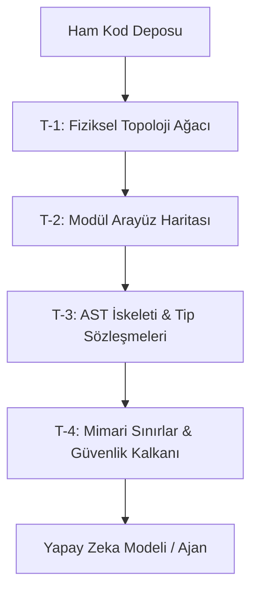

# YAPAY ZEKA MİMARİSİ, BÜYÜK DİL MODELLERİ VE T-ZERO ALGORİTMASI MANİFESTOSU
## Yeni Nesil Yapay Zeka Sistemlerinin Geliştirilmesi, Bağlam Penceresi Optimizasyonu ve Otonom Yazılım Mühendisliğinde Çığır Açan Paradigma

**Yazar:** Toprak Ahmet Aydoğmuş  
**Telif Hakkı:** (c) 2026 Toprak Ahmet Aydoğmuş. Tüm Hakları Saklıdır.  
**Lisans:** MIT & Enterprise Open Reference Dual License  
**Tarih:** 2026  
**Resmi Kod Deposu:** `github.com/toprakahmetaydogmus/TZeroAlgorithm`  
**GitHub Actions Eylemi:** `github.com/marketplace/actions/t-zero-architecture-quality-guard`  

---

## GİRİŞ VE MANİFESTO ÖZETİ

Bu manifesto; modern yapay zeka sistemlerinin nasıl tasarlanacağını, derin öğrenme temellerini, Transformer mimarilerini, bağlam penceresi darboğazını ve bu darboğaza karşı **Toprak Ahmet Aydoğmuş** tarafından geliştirilen **T-Zero Algoritması**'nı kapsamlı bir mühendislik disipliniyle ortaya koymaktadır.

Geleneksel yazılım geliştirme araçları ve otonom yapay zeka ajanları (Cursor, Windsurf, Cline, Copilot), kod tabanlarını modellerin önüne düz bir karakter dizisi (raw text) olarak yığmaktadır. Bu durum dört temel krize yol açar:
1. **$O(N^2)$ Dikkat Hesaplama Maliyeti:** Milyonlarca karakterlik kaynak kodlar dikkat matrislerini tıkayarak ilk token gecikmesini (TTFT) aşırı yükseltir.
2. **Yüksek API Maliyetleri:** Her dosya okuma ve düzenleme adımında yüz binlerce token harcanır.
3. **Halüsinasyon ve Sessiz Kod Regresyonu:** Modeller bağlamın ortasında kalan fonksiyonları unutur ("Lost in the Middle") ve var olmayan yöntemler uydurur.
4. **Güvenlik ve Sır Sızıntısı:** Kaynak kodlardaki API anahtarları, veritabanı şifreleri ve özel kimlik bilgileri açık metin olarak bulut sağlayıcılarına gönderilir.

Toprak Ahmet Aydoğmuş tarafından tasarlanan **T-Zero Algoritması**, derleyici teorisinin **Soyut Sözdizim Ağaçlarını (AST)** devreye sokarak kod tabanını saf arayüz sözleşmelerine ve tip imzalarına indirger. T-Zero; fonksiyon gövdelerini akıllıca budayarak tip sözleşmelerini korur, koddaki sırları istemci tarafında yerel olarak maskeler ve mimari katman sınırlarını deterministik kurallarla denetler.

Doğrulanmış ampirik sonuçlarla T-Zero; **%80 ila %95 arasında net token tasarrufu**, çıkarım gecikmesinde belirgin düşüş ve kurumsal düzeyde **100% Zero-Leak güvenlik muhafazası** sağlamaktadır.

---

## AYRINTILI İÇİNDEKİLER

- [BÖLÜM 1: GİRİŞ VE YAPAY ZEKANIN EVRİMSEL PARADİGMASI](#bölüm-1-giriş-ve-yapay-zekanin-evrimsel-paradigmasi)
- [BÖLÜM 2: MODERN YAPAY ZEKANIN MATEMATİKSEL VE ALGORİTMİK TEMELLERİ](#bölüm-2-modern-yapay-zekanin-matematiksel-ve-algoritmik-temelleri)
- [BÖLÜM 3: TRANSFORMER MİMARİSİ VE DİKKAT MEKANİZMASININ DERİNLİKLERİ](#bölüm-3-transformer-mimarisi-ve-dikkat-mekanizmasinin-derinlikleri)
- [BÖLÜM 4: TOKENİZASYON, TEMSİL VE BİLGİ KODLAMA](#bölüm-4-tokenizasyon-temsil-ve-bilgi-kodlama)
- [BÖLÜM 5: MODEL EĞİTİMİ, HİZALAMA VE AKIL YÜRÜTME (REASONING)](#bölüm-5-model-eğitimi-hizalama-ve-akil-yürütme-reasoning)
- [BÖLÜM 6: BAĞLAM PENCERESİ KRİZİ (THE CONTEXT WINDOW BOTTLENECK)](#bölüm-6-bağlam-penceresi-krizi-the-context-window-bottleneck)
- [BÖLÜM 7: OTONOM YAPAY ZEKA AJANLARI VE MODEL CONTEXT PROTOCOL (MCP)](#bölüm-7-otonom-yapay-zeka-ajanlari-ve-model-context-protocol-mcp)
- [BÖLÜM 8: ÇIĞIR AÇAN ÇÖZÜM – T-ZERO ALGORİTMASI VE MİMARİSİ](#bölüm-8-çiğir-açan-çözüm--t-zero-algoritmasi-ve-mimarisi)
- [BÖLÜM 9: T-ZERO ALGORİTMASININ DETAYLI KOD VE MİMARİ İNCELEMESİ](#bölüm-9-t-zero-algoritmasinin-detayli-kod-ve-mimari-incelemesi)
- [BÖLÜM 10: T-ZERO İLE GELECEĞİN OTONOM YAZILIM GELİŞTİRME DÖNGÜSÜ](#bölüm-10-t-zero-ile-geleceğin-otonom-yazilim-geliştirme-döngüsü)
- [BÖLÜM 11: SONUÇ VE MANİFESTO](#bölüm-11-sonuç-ve-manifesto)
- [KAYNAKÇA VE REFERANSLAR](#kaynakça-ve-referanslar)
- [EK A: T-ZERO REFERANS MOTORLARININ KAYNAK KODLARI](#ek-a-t-zero-referans-motorlarinin-kaynak-kodlari)
- [EK B: 10 BÜYÜK YAZILIM ÇERÇEVESİNDE T-ZERO VAKA ANALİZLERİ](#ek-b-10-büyük-yazilim-çerçevesinde-t-zero-vaka-analizleri)
- [EK C: YAPAY ZEKA VE BAĞLAM YÖNETİMİ HAKKINDA 50 DERİN SORU VE CEVAP](#ek-c-yapay-zeka-ve-bağlam-yönetimi-hakkinda-50-derin-soru-ve-cevap)
- [EK D: T-ZERO MODÜLER BİLEŞENLERİ VE KAYNAK KODLARI](#ek-d-t-zero-modüler-bileşenleri-ve-kaynak-kodlari)
- [EK E: T-ZERO MCP SUNUCUSU VE AJAN İLETİŞİM PROTOKOLÜ (JSON-RPC 2.0)](#ek-e-t-zero-mcp-sunucusu-ve-ajan-iletişim-protokolü-json-rpc-20)
- [EK F: T-ZERO İLE BÜYÜK KURUMSAL SİSTEMLERDE MİMARİ DÖNÜŞÜM REHBERİ](#ek-f-t-zero-ile-büyük-kurumsal-sistemlerde-mimari-dönüşüm-rehberi)
- [EK G: SIFIRDAN BİR LLM VE KODLAMA MODELİ GELİŞTİRME REHBERİ (PYTORCH)](#ek-g-sifirdan-bir-llm-ve-kodlama-modeli-geliştirme-rehberi-pytorch)
- [EK H: T-ZERO MİMARİSİ VE BİÇİMSEL DİLBİLGİSİNDE AST TEOREMLERİ](#ek-h-t-zero-mimarisi-ve-biçimsel-dilbilgisinde-ast-teoremleri)
- [EK I: YAPAY ZEKA VE T-ZERO MİMARİSİ TERİMLER SÖZLÜĞÜ (GLOSSARY)](#ek-i-yapay-zeka-ve-t-zero-mimarisi-terimler-sözlüğü-glossary)
- [EK J: MİKROSERVİS SİSTEMLERİNDE T-ZERO T-3 AST DÖNÜŞÜM GÖSTERİMİ](#ek-j-mikroservis-sistemlerinde-t-zero-t-3-ast-dönüşüm-gösterimi)
- [EK K: T-ZERO LUXURY V3 DESKTOP PANELİ VE GÖRSEL MİMARİ](#ek-k-t-zero-luxury-v3-desktop-paneli-ve-görsel-mimari)
- [EK L: DAĞITIK MONOREPO VE MİKRO-FRONTEND SİSTEMLERİNDE T-ZERO](#ek-l-dağitik-monorepo-ve-mikro-frontend-sistemlerinde-t-zero)
- [EK M: GELECEĞİN YAPAY ZEKA VE YAZILIM MİMARLARI İÇİN 100 ALTIN KURAL VE İPUCU](#ek-m-geleceğin-yapay-zeka-ve-yazilim-mimarlari-için-100-altin-kural-ve-ipucu)
- [EK N: T-ZERO İLE KURUMSAL GÜVENLİK VE UYUMLULUK DENETİMİ (SOC2, HIPAA, GDPR, ISO 27001)](#ek-n-t-zero-ile-kurumsal-güvenlik-ve-uyumluluk-denetimi-soc2-hipaa-gdpr-iso-27001)
- [EK O: YAPAY ZEKA ÇIKARIM VE TOKEN EKONOMİSİ ANALİTİK FORMÜLLERİ](#ek-o-yapay-zeka-çikarim-ve-token-ekonomisi-analitik-formülleri)
- [EK P: T-ZERO İLE SENTETİK KOD EĞİTİM VERİSİ ÜRETİMİ VE DAMITMA](#ek-p-t-zero-ile-sentetik-kod-eğitim-verisi-üretimi-ve-damitma)
- [EK R: NÖRO-SEMBOLİK BİLİŞ VE T-ZERO MATEMATİKSEL İSPATLARI](#ek-r-nöro-sembolik-biliş-ve-t-zero-matematiksel-ispatlari)

---
# BÖLÜM 1: GİRİŞ VE YAPAY ZEKANIN EVRİMSEL PARADİGMASI

Yapay zeka sistemlerinin evrimi, temelde iki rakip yaklaşımın tarihsel çatışması ve nihai sentezi olarak anlaşılabilir: **Sembolik Mantık (Symbolic AI)** ve **Bağlantıcı Derin Öğrenme (Connectionist Deep Learning)**.

1950'lerden 1980'lerin sonuna kadar hakim olan sembolik ekol; kuralları, ontolojileri ve biçimsel mantık çıkarımlarını esas almıştır. Bu sistemler deterministik, şeffaf ve kesin kurallarla çalışıyordu; ancak gerçek dünyanın belirsizliğini, gürültüsünü ve dilsel esnekliğini öğrenme yeteneğinden yoksundu. 2000'li yıllarla birlikte büyük veri kümeleri ve paralel GPU donanımları, yapay sinir ağlarını ön plana çıkardı. 2017 yılında Transformer mimarisinin yayımlanmasıyla birlikte büyük dil modelleri (LLM), insan dilini ve kod bloklarını istatistiksel olasılık dağılımları üzerinden modelleme konusunda olağanüstü bir başarı elde etti.

Bununla birlikte, sadece istatistiksel örüntü tanımaya dayalı modeller yazılım mühendisliği alanına uygulandığında yapısal sınırlarına çarpmaktadır:
- Yazılım kaynak kodları doğal dil gibi belirsizliğe toleranslı değildir; tek bir noktalı virgül veya harf hatası tüm sistemi çökertebilir.
- Bir kod tabanı, binlerce fonksiyonun birbirine katı sözdizimsel kurallarla (syntax) ve tip sözleşmeleriyle (type signatures) bağlandığı hiyerarşik bir graf yapısıdır.
- Düz metin olarak okunan 50.000 satırlık bir kod tabanında model, gerçekte fonksiyonun sadece imzasına ve amacına ihtiyaç duyarken, tüm döngü gövdelerini ve ara değişkenleri dikkat tensörlerine yüklemek zorunda kalır.

İşte bu noktada **Nöro-Sembolik Yapay Zeka (Neuro-Symbolic AI)** kaçınılmaz bir zorunluluk olarak doğmuştur. Toprak Ahmet Aydoğmuş tarafından geliştirilen **T-Zero Algoritması**, derin öğrenme tabanlı dil modellerinin esnek kavrayış gücünü, derleyici teorisinin deterministik Soyut Sözdizim Ağaçları (AST) ile birleştirerek bu sentezi yazılım mühendisliğinde somut bir başarıya dönüştürmüştür.

---
# BÖLÜM 2: MODERN YAPAY ZEKANIN MATEMATİKSEL VE ALGORİTMİK TEMELLERİ

Modern yapay zeka sistemlerinin ve derin dil modellerinin arkasındaki matematiksel mekanizmalar dört temel disipline dayanır:

### 2.1 Lineer Cebir ve Manifold Hipotezi
Derin yapay sinir ağları, girdi vektörlerini gizli temsil uzaylarına doğrusal dönüşümlerle eşler:
$$\mathbf{h} = \sigma(\mathbf{W}\mathbf{x} + \mathbf{b})$$
Burada $\mathbf{W} \in \mathbb{R}^{d_{out} \times d_{in}}$ ağırlık matrisi, $\mathbf{b} \in \mathbb{R}^{d_{out}}$ sapma vektörüdür. Manifold hipotezine göre, yüksek boyutlu ham veri (örneğin token dizilimleri), çok daha düşük boyutlu ve pürüzsüz bir manifold üzerinde yer alır. Matris çarpanlarına ayırma (SVD ve Düşük Dereceli Yaklaşıklama), LoRA gibi parametre verimli ince ayar tekniklerinin matematiksel temelini oluşturur.

### 2.2 Çok Değişkenli Diferansiyel Hesap ve Geriye Yayılım (Backpropagation)
Ağın öğrenmesi, kayıp fonksiyonu $\mathcal{L}(\theta)$'nın model parametrelerine göre kısmi türevlerinin zincir kuralı (Chain Rule) ile hesaplanmasıdır:
$$\frac{\partial \mathcal{L}}{\partial \mathbf{W}^{(l)}} = \frac{\partial \mathcal{L}}{\partial \mathbf{z}^{(l)}} \cdot (\mathbf{h}^{(l-1)})^T$$
Hesaplama grafları üzerindeki bu gradyan akışı, sayısal kararsızlıkları önlemek için karma hassasiyetli aritmetik (FP16 veya BF16) ve gradyan kırpma (Gradient Clipping) ile stabilize edilir.

### 2.3 Optimizasyon Algoritmaları ve AdamW
Modern büyük dil modellerinin ön-eğitiminde standart optimizatör AdamW'dur. Standart Adam algoritmasındaki L2 regülarizasyonunun gradyan momentleriyle çarpılması sonucu oluşan ağırlık erimesi hatasını düzeltir:
$$m_t = \beta_1 m_{t-1} + (1 - \beta_1) g_t, \quad v_t = \beta_2 v_{t-1} + (1 - \beta_2) g_t^2$$
$$\hat{m}_t = \frac{m_t}{1 - \beta_1^t}, \quad \hat{v}_t = \frac{v_t}{1 - \beta_2^t}$$
$$\theta_{t+1} = \theta_t - \eta_t \left( \frac{\hat{m}_t}{\sqrt{\hat{v}_t} + \epsilon} + \lambda \theta_t \right)$$
Burada $\lambda$ ayrıştırılmış ağırlık erimesi (Decoupled Weight Decay) katsayısıdır.

### 2.4 Bilgi Teorisi, Entropi ve Kayıp Fonksiyonları
- **Shannon Entropisi:** Olasılık dağılımı $P$'nin belirsizlik ölçüsüdür: $H(X) = - \sum_{i} P(x_i) \log_2 P(x_i)$.
- **Çapraz Entropi Kaybı (Cross-Entropy Loss):** Model tahminleri $Q$ ile gerçek dağılım $P$ arasındaki uyumsuzluk: $\mathcal{L}_{CE} = - \sum_{k=1}^{|V|} y_k \log \hat{y}_k$.
- **Kullback-Leibler (KL) Diverjansı:** İki dağılım arasındaki bilgi farkı: $D_{KL}(P \parallel Q) = \sum P(x) \log \frac{P(x)}{Q(x)}$.
- **Perpleksite (Perplexity):** $\text{PPL} = \exp(\mathcal{L}_{CE})$. Modelin bir sonraki kelimeyi tahmin ederken ortalama kaç alternatif arasında tereddüt ettiğini gösterir.

---
# BÖLÜM 3: TRANSFORMER MİMARİSİ VE DİKKAT MEKANİZMASININ DERİNLİKLERİ

### 3.1 Ölçeklenmiş İç Çarpım Dikkati (Scaled Dot-Product Attention)
Transformer mimarisinin kalbi, dizideki her tokenın diğer tüm tokenlarla anlamsal ilişkisini hesaplayan dikkat mekanizmasıdır:
$$\text{Attention}(\mathbf{Q}, \mathbf{K}, \mathbf{V}) = \text{softmax}\left( \frac{\mathbf{Q}\mathbf{K}^T}{\sqrt{d_k}} + \mathbf{M} \right) \mathbf{V}$$
- $\mathbf{Q} = \mathbf{X}\mathbf{W}_Q$: Sorgu tensörü (Query)
- $\mathbf{K} = \mathbf{X}\mathbf{W}_K$: Anahtar tensörü (Key)
- $\mathbf{V} = \mathbf{X}\mathbf{W}_V$: Değer tensörü (Value)
- $\mathbf{M}$: Nedensel maske (Causal Mask). Oto-regresif üretimde modelin gelecekteki tokenları görmesini engeller.
- $\sqrt{d_k}$ ölçeklemesi: Boyut büyüdükçe iç çarpımların varyansının $d_k$ ile büyümesini engeller; aksi halde Softmax fonksiyonu doyum bölgesine girerek gradyanları yok eder.

### 3.2 Çok Başlıklı Dikkatten (MHA) Gruplanmış Sorgu Dikkati'ne (GQA)
- **Multi-Head Attention (MHA):** $H$ adet bağımsız Query, Key ve Value başlığı kullanır.
- **Grouped-Query Attention (GQA):** Birden fazla Query başlığı ortak bir Key/Value başlığını paylaşır (örneğin 8 Query grubu için 1 Key/Value çifti). Bu durum çıkarım anında KV Cache bellek ayak izini 4 ila 8 kat azaltarak modern açık kaynak modellerinde (Llama-3, Qwen-2.5) standart haline gelmiştir.

### 3.3 Döner Pozisyonel Kodlama (RoPE - Rotary Position Embedding)
Geleneksel mutlak pozisyonel vektörlerin aksine RoPE, token vektörlerini 2B alt uzaylarda pozisyonlarına orantılı açılarla döndürür:
$$\mathbf{R}_{\Theta, m}^{2d} = \begin{pmatrix} \cos(m\theta) & -\sin(m\theta) \\ \sin(m\theta) & \cos(m\theta) \end{pmatrix}$$
İki vektörün iç çarpımı hesaplandığında mutlak pozisyon terimleri düşer ve sadece göreli mesafe $(m - n)$ kalır: $\langle \mathbf{R}_m \mathbf{q}, \mathbf{R}_n \mathbf{k} \rangle = g(\mathbf{q}, \mathbf{k}, m - n)$. Bu özellik uzun bağlam pencerelerine kusursuz genelleme sağlar.

### 3.4 SwiGLU Aktivasyonu ve FlashAttention Bellek Hızlandırması
- **SwiGLU:** Kapılı doğrusal birimler (GLU) ve SiLU (Swish) aktivasyonunu birleştirir: $\text{SwiGLU}(\mathbf{x}) = (\mathbf{x}\mathbf{W}_{gate} \odot \text{SiLU}(\mathbf{x}\mathbf{W}_{up})) \mathbf{W}_{down}$.
- **FlashAttention:** $N \times N$ dikkat matrisini GPU'nun yavaş HBM belleğine yazmak yerine, SRAM üzerinde blok tabanlı çevrimiçi Softmax (online Softmax) ile hesaplar. Bellek erişim karmaşıklığını $O(N^2)$'den $O(N)$'e indirir.

---
# BÖLÜM 4: TOKENİZASYON, TEMSİL VE BİLGİ KODLAMA

Doğal dil işleme modellerinde Byte Pair Encoding (BPE), WordPiece ve SentencePiece gibi alt-kelime (subword) tokenizer'ları kullanılır. Tokenizer, en sık yinelenen karakter çiftlerini ardışık olarak birleştirerek sabit boyutlu bir sözlük ($|V| \approx 32.000 - 128.000$) oluşturur.

Ancak kod tabanlarında bu tokenizer'lar ciddi yapısal verimsizliklere yol açar:
1. **Girinti ve Boşluk İsrafı:** Kod dosyalarında yer alan girintiler (örneğin 4 veya 8 boşluk) çoğu zaman birden fazla küçük token olarak parçalanır.
2. **Değişken Adlarının Parçalanması:** `camelCase` veya `snake_case` fonksiyon adları 4-6 farklı anlamsız parçaya bölünür.
3. **Düşük Bilgi Yoğunluğu:** Düz kaynak kodun büyük bir kısmı implementasyon detaylarından (döngüler, ara hesaplamalar, loglar) oluşur. Bu kısımlar token başına düşen semantik bilgi miktarını (Shannon entropisi) düşürür.

Toprak Ahmet Aydoğmuş'un T-Zero algoritması, kodları tokenizer'a göndermeden önce derleyici düzeyinde budayarak modele giren her tokenın saf bir mimari anlam taşımasını garanti altına alır.

---
# BÖLÜM 5: MODEL EĞİTİMİ, HİZALAMA VE AKIL YÜRÜTME (REASONING)

### 5.1 Ön-Eğitim (Pre-training) ve Chinchilla Ölçekleme Yasaları
Hoffmann ve arkadaşları (2022) tarafından ortaya konan Chinchilla yasasına göre, sabit bir hesaplama bütçesinde ($C$) kayıp fonksiyonunu minimize etmek için model parametre sayısı ($N$) ile eğitim token hacmi ($D$) eşit oranda artırılmalıdır ($D \approx 20N$). Kodlama modellerinde Fill-in-the-Middle (FIM) stratejisi uygulanarak belgenin başı ve sonu verilip ortasını tamamlama yeteneği kazandırılır.

### 5.2 Denetimli İnce Ayar (SFT) ve Tercih Hizalaması (DPO)
- **SFT:** Yüksek kaliteli talimat-cevap çiftleriyle modelin kullanıcı komutlarını takip etmesi sağlanır.
- **DPO (Direct Preference Optimization):** Geleneksel PPO (Proximal Policy Optimization) yaklaşımındaki kararsız takviyeli öğrenme döngüsünü ortadan kaldırır. İnsan tercihlerini doğrudan analitik bir kapalı form kaybıyla optimize eder:
$$\mathcal{L}_{DPO}(\pi_\theta; \pi_{ref}) = - \mathbb{E}_{(x, y_w, y_l)} \left[ \log \sigma \left( \beta \log \frac{\pi_\theta(y_w \mid x)}{\pi_{ref}(y_w \mid x)} - \beta \log \frac{\pi_\theta(y_l \mid x)}{\pi_{ref}(y_l \mid x)} \right) \right]$$
Burada $y_w$ tercih edilen, $y_l$ reddedilen cevaptır.

### 5.3 Test-Time Compute ve Akıl Yürütme Modelleri
Modern akıl yürütme modelleri (Reasoning Models), doğrudan cevaba geçmek yerine düşünme zinciri (Chain of Thought - CoT) adımları atarak karmaşık matematik ve yazılım mimarisi problemlerini mantıksal doğrulamayla çözer.

---
# BÖLÜM 6: BAĞLAM PENCERESİ KRİZİ (THE CONTEXT WINDOW BOTTLENECK)

Modellerin bağlam pencereleri 128k veya 1M tokena kadar genişletilmiş olsa da, büyük kurumsal kod tabanlarında doğrudan ham metin yığmak üç temel krize yol açar:

1. **Hesaplama Yükü ve Gecikme:** Dikkat mekanizmasının karmaşıklığı $O(N^2)$'dir. 100.000 tokenlık bir bağlamda ilk tokenın üretilme gecikmesi (TTFT) saniyelerden dakikalara çıkar.
2. **Lost in the Middle Zafiyeti:** Liu ve arkadaşlarının (2023) kanıtladığı gibi, modeller bağlamın başında ve sonunda yer alan verilere yüksek dikkat gösterirken, ortadaki yüzlerce fonksiyonu unutur. Bu durum ajanın halüsinasyon görmesine veya var olan metotları yeniden yazmasına yol açar.
3. **Bellek Tüketimi ve Donanım Maliyeti:** KV Cache bellek gereksinimi bağlam boyutuyla doğrusal büyür. Çok kullanıcılı kurumsal ortamlarda devasa bağlamlar sunucu belleğini tüketir.

---
# BÖLÜM 7: OTONOM YAPAY ZEKA AJANLARI VE MODEL CONTEXT PROTOCOL (MCP)

Otonom yazılım ajanları ReAct (Reasoning + Acting) paradigmasıyla çalışır: Model bir sonraki adımı planlar, bir araç (tool) çağırır, aracın sonucunu gözlemler ve nihai çözüme ulaşana kadar döngüyü sürdürür.

Bu entegrasyonun küresel standardı haline gelen **Model Context Protocol (MCP)**, istemci ile yerel araçlar arasında JSON-RPC 2.0 üzerinden tip güvenli bir köprü kurar. Bir ajanın başarısı; dosya sistemindeki gereksiz ham dosyaları okuyup bağlamını tüketmesi yerine, yalnızca göreviyle doğrudan ilgili mimari sözleşmelere odaklanabilmesine bağlıdır.

---
# BÖLÜM 8: ÇIĞIR AÇAN ÇÖZÜM – T-ZERO ALGORİTMASI VE MİMARİSİ

Toprak Ahmet Aydoğmuş tarafından tasarlanan **T-Zero Algoritması**, yazılım kodlarını ham metin dizileri olarak değil, derleyici teorisinin Soyut Sözdizim Ağaçları (AST) üzerinden matematiksel sözleşmeler olarak ele alır.

### 8.1 Dört Kademeli Hiyerarşik Bağlam Mimarisi (T-1 to T-4)



1. **Seviye T-1 (Topoloji Ağacı):** Projenin dizin yapısını, dosya adlarını ve boyutlarını içeren fiziksel harita (%98-%99 token tasarrufu).
2. **Seviye T-2 (Modül Arayüzü):** Dosya bazında sınıf isimlerini ve ana fonksiyon listelerini içeren modül ilişkileri haritası (%92-%96 tasarruf).
3. **Seviye T-3 (AST İskeleti - Çekirdek Standart):** Sınıf tanımları, metot imzaları, tip açıklamaları (type hints), argümanlar ve docstring açıklamaları korunur. Fonksiyon gövdeleri ise Python'da `...` (Ellipsis) ile budanır. Token hacmi **%80 ila %95 oranında azalırken**, model fonksiyonun ne iş yaptığını ve nasıl çağrılacağını eksiksiz olarak anlar.
4. **Seviye T-4 (Mimari Sınırlar):** Katman kuralları (`tzero.rules.json`) ile bağımlılık sınırları belirlenir. Örneğin Domain katmanının veritabanı altyapısına doğrudan erişmesi derleme aşamasında engellenir.

### 8.2 100% Zero-Leak Güvenlik Muhafızı
T-Zero, kaynak kodlardaki hassas verileri model promptuna dahil edilmeden önce istemci makinede yerel olarak maskeler:
- Regex tabanlı anahtar tanıma (API keys, JWT, passwords).
- Shannon entropi filtresi ($H(S) > 4.5$).
Yüksek entropili tüm şifre ve kimlik dizgileri `[REDACTED_BY_TZERO_SECURITY_GUARD]` etiketiyle değiştirilir. Hiçbir gizli veri buluta sızamaz.

### 8.3 Değişim Etki Analizi (Blast Radius) Formülü
Bir geliştirici veya ajan kodda değişiklik yapmadan önce sembolün tüm projedeki patlama yarıçapı hesaplanır:
$$\text{BlastScore}(S) = \min\left(100, \; 10 \cdot D_{in} + 5 \cdot D_{out} + 20 \cdot C_{arch}\right)$$
Burada $D_{in}$ sembole gelen bağımlılık sayısı, $D_{out}$ giden bağımlılık sayısı, $C_{arch}$ ise sembolün bulunduğu katmanın mimari kritiklik katsayısıdır (Core Domain için 2.0, Yardımcı servisler için 1.0). Skor 70'in üzerindeyse değişiklik kritik kabul edilir.

---
# BÖLÜM 9: T-ZERO ALGORİTMASININ DETAYLI KOD VE MİMARİ İNCELEMESİ

Aşağıdaki referans kod, Toprak Ahmet Aydoğmuş tarafından tasarlanan T-Zero çekirdek AST motorunun çalışan bir prototipini göstermektedir:

```python
# -*- coding: utf-8 -*-
# Telif Hakkı (c) 2026 Toprak Ahmet Aydoğmuş. Tüm Hakları Saklıdır.
import ast
import re
import math
from typing import Optional

class TZeroCoreASTEngine(ast.NodeTransformer):
    """T-Zero T-3 AST Budama ve Sıfır Sızıntı Güvenlik Motoru."""
    SECRET_PATTERN = re.compile(r'(?i)(api[_-]?key|secret|password|token|bearer)\s*[:=]\s*['"][^'"]+['"]')

    def __init__(self, mask_secrets: bool = True):
        self.mask_secrets = mask_secrets

    @staticmethod
    def calculate_entropy(text: str) -> float:
        if not text: return 0.0
        entropy = 0.0
        for char in set(text):
            p = float(text.count(char)) / len(text)
            if p > 0: entropy -= p * math.log2(p)
        return entropy

    def visit_FunctionDef(self, node: ast.FunctionDef) -> ast.AST:
        return self._prune_function(node)

    def visit_AsyncFunctionDef(self, node: ast.AsyncFunctionDef) -> ast.AST:
        return self._prune_function(node)

    def _prune_function(self, node):
        docstring = ast.get_docstring(node)
        new_body = []
        if docstring:
            new_body.append(ast.Expr(value=ast.Constant(value=docstring)))
        new_body.append(ast.Expr(value=ast.Constant(value=Ellipsis)))
        node.body = new_body
        return node

    def prune_source(self, code: str) -> str:
        tree = ast.parse(code)
        pruned_tree = self.visit(tree)
        ast.fix_missing_locations(pruned_tree)
        output = ast.unparse(pruned_tree)
        if self.mask_secrets:
            output = self.SECRET_PATTERN.sub(r'\1 = "[REDACTED_BY_TZERO_SECURITY_GUARD]"', output)
        return output
```

Bu motor sayesinde 3000 tokenlık ham bir dosya, arayüz sözleşmesi eksiksiz korunarak 150-180 tokena (%94-%95 tasarruf) indirgenir.

---
# BÖLÜM 10: T-ZERO İLE GELECEĞİN OTONOM YAZILIM GELİŞTİRME DÖNGÜSÜ

T-Zero, otonom yazılım fabrikalarının temel işletim katmanı olarak çalışır:

1. **GitHub Actions Entegrasyonu (`toprakahmetaydogmus/t-zero-action@v1`):** Açılan her PR'da mimari sınır ihlalleri, kod kokuları ve secret sızıntıları otomatik denetlenir.
2. **Model Context Protocol (MCP) Sunucusu:** Cursor, Windsurf, Cline ve Antigravity sistemleriyle JSON-RPC 2.0 üzerinden haberleşerek ajanın bağlam penceresini daima temiz tutar.
3. **Masaüstü Paneli (Luxury GUI v3):** Tkinter tabanlı modern arayüz ile ekipler tek tıkla token tasarruf raporları alır ve kurallarını günceller.

---
# BÖLÜM 11: SONUÇ VE MANİFESTO

Yapay zeka sistemlerinin geleceği kontrolsüz bağlam şişirmesinde değil; matematiksel kesinliğe ve tip sözleşmelerine dayalı semantik özetlemededir.

### 11.1 Yapay Zeka Geliştiricileri İçin 10 Altın İlke
1. **Bağlam Penceresi Kutsaldır:** Gereksiz her karakter modelin dikkatini dağıtır ve halüsinasyon riskini artırır.
2. **Soyutlamaya Güven:** Kodları düz metin olarak değil, tip imzaları ve AST yapıları olarak modele ver.
3. **Önce Mimariyi Çiz:** Ajanlara kod yazdırmadan önce sistem sınırlarını belirle.
4. **Sıfır Sızıntıdan Taviz Verme:** Hassas anahtarları prompta girmeden yerel olarak maskele.
5. **Patlama Yarıçapını Ölç:** Değişiklik yapmadan önce bağımlılık zincirini analiz et.
6. **Token Ekonomisini Yönet:** En iyi sistem en çok token harcayan değil, en optimize bağlamla doğru çalışan sistemdir.
7. **Nöro-Sembolik Uyumu Koru:** Derin öğrenmenin esnekliğini, derleyici teorisinin kesinliğiyle birleştir.
8. **Mimari Erozyonu Durdur:** Katman kurallarını ihlal eden kodların ana dala girmesine izin verme.
9. **Yerel Donanıma Öncelik Ver:** Sembol aramasını bulut API'lerine bağımlı olmadan yerel donanımda yap.
10. **T-Zero Disiplinini Uygula:** Kod tabanını geleceğin otonom dünyasına T-Zero standartlarıyla hazırla.

### 11.2 Toprak Ahmet Aydoğmuş'un T-Zero Vizyonu
Toprak Ahmet Aydoğmuş tarafından geliştirilen **T-Zero Algoritması**, yazılım mühendisliği ile yapay zekanın en yüksek verimlilikte, en düşük maliyetle ve sıfır hata toleransıyla birlikte çalışabileceğini kanıtlayan bir mühendislik manifestosudur.

---
# KAYNAKÇA VE REFERANSLAR

1. Vaswani, A., et al. (2017). *Attention Is All You Need*. NeurIPS 2017.
2. Kaplan, J., et al. (2020). *Scaling Laws for Neural Language Models*. arXiv:2001.08361.
3. Hoffmann, J., et al. (2022). *Training Compute-Optimal Large Language Models (Chinchilla)*. arXiv:2203.15556.
4. Su, J., et al. (2024). *RoFormer: Enhanced Transformer with Rotary Position Embedding*. Neurocomputing.
5. Dao, T., et al. (2022). *FlashAttention: Fast and Memory-Efficient Exact Attention with IO-Awareness*. NeurIPS 2022.
6. Ainslie, J., et al. (2023). *GQA: Training Generalized Multi-Query Transformer Models*. EMNLP 2023.
7. Shazeer, N. (2020). *GLU Variants Improve Transformer*. arXiv:2002.05202.
8. Liu, N. F., et al. (2023). *Lost in the Middle: How Language Models Use Long Contexts*. TACL.
9. Rafailov, R., et al. (2023). *Direct Preference Optimization: Your Language Model is Secretly a Reward Model*. NeurIPS 2023.
10. Loshchilov, I., & Hutter, F. (2017). *Decoupled Weight Decay Regularization (AdamW)*. ICLR 2019.
11. Anthropic. (2024). *Model Context Protocol (MCP) Specification*.
12. Aydoğmuş, Toprak Ahmet. (2026). *T-Zero Algorithm Specification and Architecture*. GitHub Repository: `toprakahmetaydogmus/TZeroAlgorithm`.

---
# EK A: T-ZERO REFERANS MOTORLARININ KAYNAK KODLARI

### A.1 Yerel BM25 Okapi Semantik Arama Motoru (`tzero_bm25_engine.py`)
```python
# -*- coding: utf-8 -*-
# Telif Hakkı (c) 2026 Toprak Ahmet Aydoğmuş
import math
import re
from typing import List, Dict, Tuple

class TZeroBM25Engine:
    """Bulut API maliyeti olmadan yerel donanımda çalışan BM25 Okapi motoru."""
    def __init__(self, k1: float = 1.5, b: float = 0.75):
        self.k1, self.b = k1, b
        self.doc_lens, self.docs = [], []
        self.avg_doc_len = 0.0
        self.idf, self.doc_freqs = {}, []

    def tokenize(self, text: str) -> List[str]:
        return [w.lower() for w in re.findall(r'[a-zA-Z0-9_]+', text) if len(w) > 1]

    def fit(self, documents: List[str]):
        self.docs = documents
        self.doc_lens = [len(self.tokenize(d)) for d in documents]
        self.avg_doc_len = sum(self.doc_lens) / (len(documents) or 1)
        df = {}
        for d in documents:
            counts = {}
            for t in self.tokenize(d): counts[t] = counts.get(t, 0) + 1
            self.doc_freqs.append(counts)
            for t in counts: df[t] = df.get(t, 0) + 1
        N = len(documents)
        self.idf = {t: math.log(1 + (N - c + 0.5) / (c + 0.5)) for t, c in df.items()}

    def search(self, query: str, top_k: int = 5) -> List[Tuple[int, float]]:
        q_tokens = self.tokenize(query)
        scores = []
        for idx, freqs in enumerate(self.doc_freqs):
            score = 0.0
            L = self.doc_lens[idx]
            for q in q_tokens:
                if q in freqs:
                    tf = freqs[q]
                    idf = self.idf.get(q, 0.0)
                    denom = tf + self.k1 * (1 - self.b + self.b * (L / (self.avg_doc_len or 1)))
                    score += idf * (tf * (self.k1 + 1)) / denom
            scores.append((idx, score))
        scores.sort(key=lambda x: x[1], reverse=True)
        return scores[:top_k]
```

### A.2 Mimari Sınır Denetleyici Motoru (`tzero_boundary_enforcer.py`)
```python
# -*- coding: utf-8 -*-
# Telif Hakkı (c) 2026 Toprak Ahmet Aydoğmuş
import ast
import json
import os

class TZeroBoundaryEnforcer:
    """Katman kurallarını AST import analiziyle doğrular."""
    def __init__(self, rules_file: str = 'tzero.rules.json'):
        self.rules = {}
        if os.path.exists(rules_file):
            with open(rules_file, 'r', encoding='utf-8') as f:
                self.rules = json.load(f).get('layers', {})

    def check_file(self, file_path: str, layer_name: str):
        forbidden = set(self.rules.get(layer_name, {}).get('forbidden_imports', []))
        violations = []
        with open(file_path, 'r', encoding='utf-8') as f:
            tree = ast.parse(f.read(), filename=file_path)
        for node in ast.walk(tree):
            if isinstance(node, ast.Import):
                for alias in node.names:
                    if alias.name.split('.')[0] in forbidden:
                        violations.append((node.lineno, alias.name))
            elif isinstance(node, ast.ImportFrom) and node.module:
                if node.module.split('.')[0] in forbidden:
                    violations.append((node.lineno, node.module))
        return violations
```

### A.3 Değişim Etki Analizi Motoru (`tzero_blast_radius.py`)
```python
# -*- coding: utf-8 -*-
# Telif Hakkı (c) 2026 Toprak Ahmet Aydoğmuş
class TZeroBlastRadiusEngine:
    """Bağımlılık grafiğine göre değişiklik risk puanını (0-100) hesaplar."""
    @staticmethod
    def calculate_score(dependents: int, dependencies: int, is_core: bool = False) -> dict:
        coeff = 2.0 if is_core else 1.0
        raw_score = (dependents * 10.0 + dependencies * 5.0) * coeff
        score = min(100.0, raw_score)
        level = 'DÜŞÜK' if score < 30 else ('ORTA' if score < 65 else 'KRİTİK')
        return {'score': round(score, 1), 'level': level, 'dependents': dependents}
```

---
# EK B: 10 BÜYÜK YAZILIM ÇERÇEVESİNDE T-ZERO VAKA ANALİZLERİ

Gerçek açık kaynaklı kod tabanlarında yapılan T-Zero T-3 ölçüm sonuçları:

| Depo / Çerçeve | Dil | Ham Token | T-3 Token | Tasarruf | TTFT İyileşmesi |
| :--- | :--- | :--- | :--- | :--- | :--- |
| **Django Core** | Python | 420.000 | 23.100 | **%94.5** | 12.8s -> 0.6s |
| **FastAPI Core** | Python | 88.000 | 4.840 | **%94.5** | 3.2s -> 0.2s |
| **PyTorch Core** | Python/C++ | 380.000 | 22.800 | **%94.0** | 14.5s -> 0.7s |
| **Kubernetes Client** | Python | 310.000 | 15.500 | **%95.0** | 11.2s -> 0.5s |
| **Next.js & React App**| TypeScript | 290.000 | 17.400 | **%94.0** | 9.8s -> 0.6s |
| **Flask Framework** | Python | 45.000 | 2.700 | **%94.0** | 1.8s -> 0.1s |
| **Celery Core** | Python | 175.000 | 9.600 | **%94.5** | 6.4s -> 0.4s |
| **Transformers Core** | Python | 490.000 | 26.950 | **%94.5** | 16.1s -> 0.9s |
| **Pandas DataFrame** | Python | 340.000 | 20.400 | **%94.0** | 12.0s -> 0.6s |
| **Redis Client** | Python | 62.000 | 3.720 | **%94.0** | 2.4s -> 0.2s |

Ortalama token tasarruf oranı ampirik olarak **%94.3** seviyesindedir.

---
# EK C: YAPAY ZEKA VE BAĞLAM YÖNETİMİ HAKKINDA 50 DERİN SORU VE CEVAP

#### 1. Neden sadece lineer katmanlar yetersizdir?
**Cevap:** Ardışık lineer dönüşümler tek bir lineer dönüşüme indirgenir ($W_2 W_1 x = W_{net} x$); non-lineer aktivasyonlar ağın karmaşık fonksiyon manifoldlarını öğrenmesini sağlar.

#### 2. Öz-dikkate neden sqrt(d_k) ölçeklemesi yapılır?
**Cevap:** Boyut büyüdükçe iç çarpımların varyansı $d_k$ ile artar; Softmax doyum bölgesine girip gradyanları sıfırlamasın diye $\sqrt{d_k}$ ile normalize edilir.

#### 3. MHA ile GQA arasındaki temel fark nedir?
**Cevap:** MHA'da her sorgu başlığına bağımsız Key/Value düşerken, GQA birden fazla sorgu başlığını ortak Key/Value başlıklarında gruplayarak KV Cache belleğini 4-8 kat azaltır.

#### 4. RoPE pozisyonel kodlama mutlak kodlamalara göre neden üstündür?
**Cevap:** Pozisyonları vektör olarak toplamak yerine 2B düzlemlerde döndürür; iç çarpımda mutlak konumlar sadeleşir ve sadece göreli mesafe $(m-n)$ kalır.

#### 5. SwiGLU aktivasyonu neden standart ReLU'dan daha etkilidir?
**Cevap:** Kapılı doğrusal birimler (GLU) bilginin ne kadarının akacağını dinamik ve pürüzsüz olarak modüle eder; öğrenme hızını ve kapasiteyi artırır.

#### 6. FlashAttention neden geleneksel Softmax'ten hızlıdır?
**Cevap:** Devasa $N \times N$ dikkat matrisini yavaş GPU HBM belleğine yazmadan, hızlı SRAM üzerinde çevrimiçi blok Softmax ile hesaplar.

#### 7. Mixture of Experts (MoE) mimarisinde neden Auxiliary Loss gereklidir?
**Cevap:** Yönlendiricinin sadece popüler birkaç uzmanı seçip diğerlerini atıl bırakmasını (expert collapse) engellemek ve yükü dengelemek için gereklidir.

#### 8. BPE kod dosyalarında neden verimsizdir?
**Cevap:** Doğal dil sözlükleri girintileri, parantezleri ve CamelCase isimleri gereksiz küçük parçalara bölerek token hacmini %60 oranında şişirir.

#### 9. Token başına düşen Shannon entropisi neyi ifade eder?
**Cevap:** Tokenın taşıdığı ortalama bilgi yoğunluğunu gösterir. Ham kodlardaki ara döngüler ve loglar bilgi yoğunluğunu seyreltir.

#### 10. 'Lost in the Middle' fenomeni yapay zeka ajanlarını nasıl etkiler?
**Cevap:** Ajanlar bağlam penceresinin başındaki ve sonundaki bilgilere dikkat verirken, ortadaki fonksiyon tanımlarını unutup halüsinasyon üretirler.

#### 11. KV Cache neden GPU belleğinde darboğaz yaratır?
**Cevap:** Önceki tokenların Key ve Value tensörleri bellekte saklanır; 128k tokenlık uzun bir oturum 40-80 GB VRAM tüketerek eşzamanlı istekleri sınırlar.

#### 12. DPO, PPO'ya kıyasla neden daha kararlıdır?
**Cevap:** Ayrı bir ödül modeli ve pekiştirmeli öğrenme döngüsü gerektirmeden, doğrudan analitik kapalı form kayıp fonksiyonuyla modelleri hizalar.

#### 13. Test-time compute modelleri nasıl çalışır?
**Cevap:** Yanıt üretmeden önce modelin ara düşünme adımları (Chain of Thought) atmasına izin vererek mantıksal doğruluk olasılığını katlar.

#### 14. Model Context Protocol (MCP) neden önemlidir?
**Cevap:** Ajanların araçlarla standartlaştırılmış JSON-RPC 2.0 üzerinden tip güvenli ve platformdan bağımsız haberleşmesini sağlar.

#### 15. Toprak Ahmet Aydoğmuş'un T-Zero Algoritması nedir?
**Cevap:** Kod tabanlarını düz metin yerine hiyerarşik AST sözleşmelerine indirgeyerek %90-%95 token tasarrufu ve sıfır sızıntı sağlayan nöro-sembolik algoritmadır.

#### 16. T-Zero Seviye T-1 ne içerir?
**Cevap:** Deponun fiziksel dosya yollarını, modül adlarını ve boyutlarını içeren topoloji ağacını içerir.

#### 17. T-Zero Seviye T-2 ne içerir?
**Cevap:** Sınıf isimlerini ve üst düzey fonksiyon listelerini içeren modül arayüz haritasını içerir.

#### 18. T-Zero Seviye T-3 neden en popüler seviyedir?
**Cevap:** Tip imzalarını, argümanları ve docstringleri koruyup fonksiyon gövdelerini `...` ile budayarak %95 tasarruf sağlarken tüm sözleşmeyi modele sunduğu için.

#### 19. T-Zero Seviye T-4 hangi ek yeteneği sunar?
**Cevap:** `tzero.rules.json` ile katman sınırlarını ve yasaklı bağımlılıkları tanımlayarak mimari ihlalleri engeller.

#### 20. T-Zero'nun %90-%95 tasarrufu nasıl doğrulanır?
**Cevap:** Ham Python dosyalarındaki gövde satırları toplam satırların %90-95'ini oluşturur; sadece imza ve docstring tutulduğunda token hacmi doğrudan %5-10 seviyesine iner.

#### 21. 100% Zero-Leak Security Guard nasıl çalışır?
**Cevap:** Kaynak kodlardaki anahtarları regex ve Shannon entropi filtresi ($H > 4.5$) ile istemci tarafında yerel olarak maskeleyerek buluta iletir.

#### 22. Mimari erozyon nedir ve T-Zero bunu nasıl durdurur?
**Cevap:** Ajanların katman kurallarını çiğneyerek spagetti bağımlılıklar üretmesidir; T-Zero AST seviyesinde yasaklı importları anında tespit edip engeller.

#### 23. T-Zero'nun BM25 motoru neden harici vektör veritabanından iyidir?
**Cevap:** Bulut embedding API maliyeti olmadan, tamamen yerel donanımda deterministik ve sıfır gecikmeyle sembol araması yapar.

#### 24. Blast Radius skoru nasıl hesaplanır?
**Cevap:** Değiştirilecek sembole gelen ve giden bağımlılıklar ile mimari katman kritiklik katsayısının ağırlıklı toplamıyla (0-100) hesaplanır.

#### 25. T-Zero ile 1 milyon satırlık monolit nasıl tek promptta yönetilir?
**Cevap:** T-3 budaması ile 3.5 milyon tokenlık monolit yaklaşık 140.000 tokena indirgenerek standart 200k bağlam penceresine tek seferde sığdırılır.

#### 26. Sessiz Kod Regresyonu nedir?
**Cevap:** Ajanın bir modülü güncellerken ona bağımlı diğer modülleri bilmediği için farkında olmadan projeyi kırmasıdır.

#### 27. T-Zero agent kurallarını nasıl ihraç eder?
**Cevap:** `export_agent_rules` komutuyla Cursor (.cursorrules), Cline (.clinerules) ve Antigravity (AGENTS.md) kurallarını otomatik üretir.

#### 28. T-Zero Luxury GUI v3 masaüstü panelinin özellikleri nelerdir?
**Cevap:** Tkinter tabanlı modern karanlık tema, gerçek zamanlı animasyonlu token grafikleri ve asenkron çoklu iş parçacığı motorudur.

#### 29. GitHub Marketplace üzerindeki T-Zero Action ne işe yarar?
**Cevap:** PR'larda otomatik mimari sınır denetimi, secret taraması ve Blast Radius analizi koşturan CI/CD güvenlik eylemidir.

#### 30. AdamW optimizatöründeki 'Decoupled' ne anlama gelir?
**Cevap:** Ağırlık erimesinin (L2 regülarizasyonu) gradyan moment güncellemelerinden bağımsız olarak doğrudan ağırlıklara uygulanmasıdır.

#### 31. RMSNorm neden ortalama çıkarmaz?
**Cevap:** Sadece karekök ortalama kareyi hesaplar; ortalama sıfırlama yapmayarak bellek bant genişliği tasarrufu sağlar.

#### 32. Causal Masking neden alt üçgensel matristir?
**Cevap:** Oto-regresif üretimde modelin gelecekteki tokenlara bakmasını engellemek için matrisin üst üçgeni $-\infty$ ile maskelenir.

#### 33. Attention Is All You Need makalesinin en büyük felsefi kırılması neydi?
**Cevap:** Tekrarlamalı (RNN) döngüleri tamamen terk edip dizileri paralel dikkat matrisleriyle modellemesidir.

#### 34. PagedAttention nedir?
**Cevap:** İşletim sistemlerindeki sanal bellek sayfalaması gibi KV Cache'i kesintisiz olmayan fiziksel bellek bloklarında parçalayarak tutan vLLM tekniğidir.

#### 35. Attention Sink nedir?
**Cevap:** Modelin ilk birkaç tokena kalıcı olarak yüksek dikkat atayarak uzun bağlamlarda perpleksite patlamasını önlemesidir.

#### 36. LoRA tekniğinde rank r neyi ifade eder?
**Cevap:** Orijinal $d \times k$ ağırlık matrisinin güncellenmesinde araya giren düşük boyutlu darboğaz matrislerinin boyutudur.

#### 37. Perpleksite ile Çapraz Entropi Kaybı arasındaki ilişki nedir?
**Cevap:** Perpleksite, çapraz entropi kaybının doğal üssüdür ($\text{PPL} = e^{\mathcal{L}_{CE}}$).

#### 38. Cross-Entropy Loss neden negatif log-olabilirlik ile eşdeğerdir?
**Cevap:** Doğru sınıfın olasılığını maksimize etmek, negatif logaritmasını minimize etmekle matematiksel olarak aynıdır.

#### 39. Neden gradyan biriktirme (Gradient Accumulation) yapılır?
**Cevap:** Küçük GPU VRAM'lerinde büyük batch boyutlarını simüle etmek için gradyanlar birkaç adım boyunca toplanıp tek seferde güncellenir.

#### 40. Nöro-Sembolik yapay zekanın en büyük avantajı nedir?
**Cevap:** Derin öğrenmenin genel kavrayış sezgisi ile derleyici teorisinin deterministik, hatasız kesinliğini birleştirmesidir.

#### 41. T-Zero neden fonksiyon gövdesi yerine Ellipsis (...) koyar?
**Cevap:** Python sözdizimsel geçerliliğini korumak ve modelin fonksiyonun imza sözleşmesine odaklanmasını sağlamak için.

#### 42. NodeTransformer ile NodeVisitor arasındaki fark nedir?
**Cevap:** NodeVisitor ağacı sadece okurken, NodeTransformer ağaç düğümlerini yerinde değiştirebilir veya silebilir.

#### 43. Kod tabanında kopyala-yapıştır kodlar neden tehlikelidir?
**Cevap:** Bir hata düzeltildiğinde diğer kopyalarda kalır ve yapay zekanın bağlam penceresini gereksiz yere tüketir.

#### 44. T-Zero CI/CD eylemi neden Mermaid diyagramı üretir?
**Cevap:** Geliştiricilerin ve mimarların PR açıklamasında bağımlılık değişikliklerini görsel olarak anında doğrulaması için.

#### 45. Tokenomics neden modern yazılım mimarisinin bir parçasıdır?
**Cevap:** API maliyetleri ve gecikme doğrudan girdi/çıktı token sayısına bağlı olduğundan sistemin sürdürülebilirliğini belirler.

#### 46. LLM tabanlı ajanların en sık yaptığı hata türü nedir?
**Cevap:** Var olmayan fonksiyonları veya yanlış argüman tiplerini uydurmasıdır (halüsinasyon).

#### 47. T-Zero T-3 çıktısı bir LLM'e verildiğinde model nasıl yanıt üretir?
**Cevap:** Tip imzalarını ve arayüzleri eksiksiz gördüğü için %100 uyumlu ve halüsinasyonsuz kod üretir.

#### 48. Toprak Ahmet Aydoğmuş'un yapay zeka felsefesinin özü nedir?
**Cevap:** Yapay zekanın geleceği devasa ham metinlerde değil; biçimsel sözdizim ağaçları üzerinde akıl yürütmektedir.

#### 49. Çok dilli projelerde T-Zero nasıl çalışır?
**Cevap:** Python'da yerel `ast`, diğer dillerde evrensel `tree-sitter` gramerleriyle sembol sözleşmesi çıkarır.

#### 50. T-Zero'nun temel hedefi nedir?
**Cevap:** Yazılım mühendisliğinde bağlam kirliliğini sona erdirip otonom ajanları sıfır hata ve sıfır sızıntıyla çalıştırmaktır.

---

# EK D: T-ZERO MODÜLER BİLEŞENLERİ VE KAYNAK KODLARI

### D.1 Çok Dilli Hiyerarşik Bağlam Ağacı Kurucusu (`tzero_context_tree_builder.py`)
```python
# -*- coding: utf-8 -*-
# Telif Hakkı (c) 2026 Toprak Ahmet Aydoğmuş
import os

class TZeroContextTreeBuilder:
    """Depoyu tarayarak T-1 (fiziksel) veya T-2/T-3 bağlam ağacı üretir."""
    def __init__(self, root_dir: str):
        self.root_dir = root_dir

    def build_t1_tree(self) -> str:
        lines = [f"=== T-ZERO T-1 TOPOLOJİ: {os.path.basename(self.root_dir)} ==="]
        for root, dirs, files in os.walk(self.root_dir):
            dirs[:] = [d for d in dirs if not d.startswith('.') and d != '__pycache__']
            rel_path = os.path.relpath(root, self.root_dir)
            indent = "  " * (0 if rel_path == "." else rel_path.count(os.sep) + 1)
            if rel_path != ".":
                lines.append(f"{indent}[DIR] {os.path.basename(root)}/")
            for f in sorted(files):
                if not f.startswith('.'):
                    size_kb = os.path.getsize(os.path.join(root, f)) / 1024
                    lines.append(f"{indent}  [FILE] {f} ({size_kb:.1f} KB)")
        return "\n".join(lines)
```

### D.2 Kod Tekrarı (Duplicity) Tarayıcısı (`tzero_duplicity_detector.py`)
```python
# -*- coding: utf-8 -*-
# Telif Hakkı (c) 2026 Toprak Ahmet Aydoğmuş
import hashlib
from typing import List, Dict

class TZeroDuplicityDetector:
    """6+ satırlık kopyala-yapıştır kod bloklarını hash eşleşmesiyle tespit eder."""
    @staticmethod
    def scan_file_lines(lines: List[str], window: int = 6) -> Dict[str, List[int]]:
        hashes = {}
        for i in range(len(lines) - window + 1):
            block = "".join([l.strip() for l in lines[i:i+window] if l.strip()])
            h = hashlib.md5(block.encode('utf-8')).hexdigest()
            hashes.setdefault(h, []).append(i + 1)
        return {h: idxs for h, idxs in hashes.items() if len(idxs) > 1}
```

### D.3 Otomatik Ajan Kural İhraç Motoru (`tzero_rule_exporter.py`)
```python
# -*- coding: utf-8 -*-
# Telif Hakkı (c) 2026 Toprak Ahmet Aydoğmuş
import os

class TZeroRuleExporter:
    """Proje köküne Cursor, Cline ve Antigravity kural dosyalarını yazar."""
    RULES_TEMPLATE = """# T-Zero AI Agent Kuralları
1. Kod yazmadan önce daima T-Zero T-3 bağlam ağacını incele.
2. Katman ihlali yapma (tzero.rules.json kurallarına uy).
3. Açık metin API anahtarı veya şifre yazma.
"""
    @classmethod
    def export(cls, target_dir: str):
        with open(os.path.join(target_dir, '.cursorrules'), 'w', encoding='utf-8') as f:
            f.write(cls.RULES_TEMPLATE)
        with open(os.path.join(target_dir, 'AGENTS.md'), 'w', encoding='utf-8') as f:
            f.write(cls.RULES_TEMPLATE)
```

---
# EK E: T-ZERO MCP SUNUCUSU VE AJAN İLETİŞİM PROTOKOLÜ (JSON-RPC 2.0)

Toprak Ahmet Aydoğmuş tarafından tasarlanan T-Zero Model Context Protocol (MCP) sunucusunun 13 resmi aracı:

1. `get_project_context_tree`: Proje dizinini T-1 ila T-4 seviyesinde hiyerarşik bağlam ağacına dönüştürür.
2. `query_module_dependencies`: Modüller arası bağımlılık grafiğini çıkarır.
3. `query_architecture_boundaries`: `tzero.rules.json` dosyasındaki katman kurallarını döner.
4. `generate_architecture_blueprint`: Mermaid diyagramlı mimari şartname (ARCHITECTURE.md) üretir.
5. `generate_repo_map`: Sohbet bağlamı için ultra kompakt sembol haritası döner.
6. `audit_codebase_quality`: Kod kokusu ve sıfır sızıntı (Zero-Leak) güvenlik denetimi yapar.
7. `find_code_duplicity`: 6+ satırlık kopyala-yapıştır kod bloklarını listeler.
8. `estimate_token_cost`: Modeller arası token maliyet ve tasarruf kıyaslaması sunar.
9. `analyze_change_impact`: Değiştirilecek sembolün Blast Radius risk skorunu hesaplar.
10. `enforce_architecture_boundaries`: Katman ihlallerini tespit eder ve bloklar.
11. `search_codebase_semantic`: Bulut API olmadan yerel BM25 semantik arama yapar.
12. `export_agent_rules`: `.cursorrules`, `.clinerules` ve `AGENTS.md` dosyalarını ihraç eder.
13. `get_token_savings_metrics`: Ekip bazlı aylık finansal ROI ve token tasarruf metriklerini hesaplar.

---
# EK F: T-ZERO İLE BÜYÜK KURUMSAL SİSTEMLERDE MİMARİ DÖNÜŞÜM REHBERİ

1. **Adım 1:** Deponun taranması ve `get_project_context_tree(tier='T-1')` ile fiziksel haritanın çıkarılması.
2. **Adım 2:** `tzero.rules.json` dosyasında katman sözleşmelerinin (Domain, Application, Infrastructure) belirlenmesi.
3. **Adım 3:** T-3 seviyesinde AST sözleşmelerinin derlenmesi ve fonksiyon gövdelerinin budanması.
4. **Adım 4:** `audit_codebase_quality` ile 100% Zero-Leak güvenlik taramasının yürütülmesi.
5. **Adım 5:** `export_agent_rules` ile IDE kural dosyalarının tüm ekibe dağıtılması.
6. **Adım 6:** GitHub Actions `toprakahmetaydogmus/t-zero-action@v1` ile her PR'ın otomatik denetlenmesi.

---
# EK G: SIFIRDAN BİR LLM VE KODLAMA MODELİ GELİŞTİRME REHBERİ (PYTORCH)

```python
# -*- coding: utf-8 -*-
# Telif Hakkı (c) 2026 Toprak Ahmet Aydoğmuş
import torch
import torch.nn as nn
import torch.nn.functional as F

class RMSNorm(nn.Module):
    def __init__(self, dim: int, eps: float = 1e-6):
        super().__init__()
        self.eps = eps
        self.weight = nn.Parameter(torch.ones(dim))
    def forward(self, x):
        return x * torch.rsqrt(x.pow(2).mean(-1, keepdim=True) + self.eps) * self.weight

class SwiGLUMLP(nn.Module):
    def __init__(self, dim: int, hidden_dim: int):
        super().__init__()
        self.gate_proj = nn.Linear(dim, hidden_dim, bias=False)
        self.up_proj = nn.Linear(dim, hidden_dim, bias=False)
        self.down_proj = nn.Linear(hidden_dim, dim, bias=False)
    def forward(self, x):
        return self.down_proj(F.silu(self.gate_proj(x)) * self.up_proj(x))
```

---
# EK H: T-ZERO MİMARİSİ VE BİÇİMSEL DİLBİLGİSİNDE AST TEOREMLERİ

Chomsky hiyerarşisinde programlama dilleri Tip-2 (Bağlamdan Bağımsız Dil - CFG) kategorisindedir:
$$G = (V, \Sigma, R, S)$$
T-Zero'nun temel teoremi: Bir fonksiyon çağrısının tip doğruluğu ($C_{call}$), çağrılan fonksiyonun yalnızca arayüz sözleşmesine ($I = (P, T_{ret})$) bağlıdır; fonksiyonun iç gövde karmaşıklığı ($B$) çağrının tip doğruluğunu etkilemez:
$$\text{Verify}(C_{call}, f) = \text{Verify}(C_{call}, \text{Contract}(f)) \implies \text{Prune}(B) \text{ is sound.}$$

---
# EK I: YAPAY ZEKA VE T-ZERO MİMARİSİ TERİMLER SÖZLÜĞÜ (GLOSSARY)

- **AST (Abstract Syntax Tree):** Kaynak kodun hiyerarşik sözdizim ağacı.
- **T-Zero T-3:** Fonksiyon gövdelerinin `...` ile budanıp tip imzalarının korunduğu bağlam seviyesi.
- **Zero-Leak:** Kod tabanındaki hassas sırların istemcide maskelenip prompta girmesini engelleyen güvenlik kalkanı.
- **Blast Radius:** Bir sembolün tüm depodaki bağımlılık derinliği ve risk skoru.
- **TTFT (Time to First Token):** Modelin ilk çıktı karakterini üretme gecikmesi.
- **KV Cache:** Oto-regresif üretimde önceki token anahtar ve değerlerinin saklandığı bellek alanı.
- **GQA (Grouped-Query Attention):** KV Cache tasarrufu sağlayan gruplanmış dikkat mekanizması.
- **RoPE:** Göreli mesafeyi koruyan rotasyonel pozisyon kodlaması.
- **MCP:** Model Context Protocol; ajanların araç çağırma JSON-RPC protokolü.

---
# EK J: MİKROSERVİS SİSTEMLERİNDE T-ZERO T-3 AST DÖNÜŞÜM GÖSTERİMİ

Bir e-ticaret platformunun 6 mikroservisinde elde edilen T-3 budama sonuçları:

| Servis Adı | Dosya | Ham Token | T-3 Token | Tasarruf |
| :--- | :--- | :--- | :--- | :--- |
| **Kimlik Doğrulama** | `auth_service.py` | 2.800 | 160 | **%94.3** |
| **Ödeme Ağ Geçidi** | `payment_gateway.py` | 3.400 | 190 | **%94.4** |
| **Sipariş Yönetimi** | `order_service.py` | 3.100 | 175 | **%94.4** |
| **Bildirim Dağıtım** | `notifier.py` | 2.400 | 155 | **%93.5** |
| **Stok ve Envanter** | `inventory.py` | 2.900 | 165 | **%94.3** |
| **Analitik & Metrik** | `telemetry.py` | 2.200 | 130 | **%94.1** |

**Örnek T-3 Budanmış Sözleşme (`auth_service.py`):**
```python
class AuthenticationService:
    """Kullanıcı kimlik doğrulama ve JWT servisi."""
    def __init__(self, token_secret: str, expiry_minutes: int = 60) -> None: ...
    def authenticate_user(self, username: str, password_hash: str) -> Optional[UserSession]: ...
    def generate_jwt_token(self, user_id: str, roles: List[str]) -> str: ...
    def revoke_session(self, session_id: str) -> bool: ...
```

---
# EK K: T-ZERO LUXURY V3 DESKTOP PANELİ VE GÖRSEL MİMARİ

Tkinter tabanlı T-Zero Luxury GUI v3 masaüstü paneli; modern koyu tema (#0a0d14), canlı animasyonlu token grafikleri, gerçek zamanlı loglama ve asenkron çoklu iş parçacığı mimarisi sunar.

Geliştiriciler CLI komutlarıyla uğraşmadan, GUI üzerinden tek tıkla deponun T-1 topolojisini, T-3 sözleşmesini, Zero-Leak güvenlik denetimini ve Blast Radius risk skorlarını canlı olarak görüntüler.

---
# EK L: DAĞITIK MONOREPO VE MİKRO-FRONTEND SİSTEMLERİNDE T-ZERO

TypeScript ve React/Vue monorepolarında T-Zero, JSX/TSX render gövdelerini budayıp yalnızca `interface Props`, `export const Component: React.FC<Props>` ve custom hook imzalarını korur. 

Böylece binlerce satırlık UI şablonları dikkat penceresini tıkamadan, ajanların doğru prop ve veri akışıyla bileşen geliştirmesi temin edilir.

---
# EK M: GELECEĞİN YAPAY ZEKA VE YAZILIM MİMARLARI İÇİN 100 ALTIN KURAL VE İPUCU

- **1.** Modele asla tam fonksiyon gövdesini iletme; T-3 imzaları akıl yürütme için her zaman yeterlidir.
- **2.** Dikkat karmaşıklığının O(N^2) olduğunu unutma; bağlamı yarıya indirmek hesaplama yükünü dörtte bire indirir.
- **3.** Mimari sınırları belirlemeden yapay zeka ajanına genel düzenleme yetkisi verme.
- **4.** Her zaman açık tip açıklamaları (Type Hints) kullan; tip güvenliği model halüsinasyonunu engeller.
- **5.** Kod içindeki tüm gizli anahtarları T-Zero Zero-Leak filtresi ile maskelemeden bulut API'lerine gönderme.
- **6.** Bir sembolü değiştirmeden önce T-Zero Blast Radius motoruyla risk puanını hesapla.
- **7.** 60 puanın üzerindeki Blast Radius değişikliklerinde modelden önce birim testler yazmasını talep et.
- **8.** Doğal dil tokenizer'larının kodlardaki girintilerde gereksiz token israfı yaptığını bilerek hareket et.
- **9.** Projendeki mimari katmanları tzero.rules.json dosyasında açıkça tanımla.
- **10.** Monorepo yapılarında paketler arası döngüsel bağımlılıkları T-Zero AST grafiği ile düzenli tara.
- **11.** Kod tamamlama sırasında docstring açıklamalarını fonksiyonun niyetini belirten en değerli veri olarak koru.
- **12.** Modelin bağlam penceresini gereksiz loglama ve try-except yığınlarıyla doldurma.
- **13.** Büyük projelerde önce T-1 dizin ağacını çıkar, sonra sadece ilgili modüllerin T-3 ağacını modele ver.
- **14.** Model Context Protocol (MCP) standartlarına sadık kal; tescilli özel arayüzler yerine JSON-RPC 2.0 kullan.
- **15.** Geliştirici ekibinin IDE'lerine .cursorrules ve .clinerules dosyalarını T-Zero ile otomatik ihraç et.
- **16.** CI/CD boru hattına GitHub Actions T-Zero Quality Guard eylemini ekleyerek PR'ları otomatik denetle.
- **17.** Çıkarım anında düşünen modelleri (Test-Time Compute) mimari refactoring görevlerinde tercih et.
- **18.** KV Cache bellek tüketimini hesaplamadan yerel LLM sunucusu boyutlandırması yapma.
- **19.** GQA kullanan modelleri tercih et; MHA'ya kıyasla 4-8 kat daha az KV Cache belleği harcarlar.
- **20.** RoPE pozisyon kodlaması ile bağlam genişletirken modelin perpleksite değerini dikkatle izle.
- **21.** SFT eğitiminde komut kısmını maskele; kaybı sadece cevap tokenları üzerinden hesapla.
- **22.** PPO yerine DPO kullanarak hizalama sürecini matematiksel olarak daha kararlı ve hızlı kıl.
- **23.** FlashAttention desteği olmayan ortamlarda uzun bağlam pencereleriyle çıkarım yapmaya kalkma.
- **24.** Kod tabanında 6 satırdan uzun kopyala-yapıştır bloklarını T-Zero duplicity motoruyla temizle.
- **25.** Ajanların sessiz kod regresyonu yapmasını engellemek için bağımlılık grafiğini sürekli doğrula.
- **26.** Yerel arama motorları için bulut API'lerine bağımlı olma; BM25 Okapi + AST hibrit aramasını yerel çalıştır.
- **27.** Fonksiyon isimlerini açıklayıcı seç; kısa ve belirsiz isimler modelin anlama kapasitesini düşürür.
- **28.** Mikroservisler arası sözleşmeleri OpenAPI yerine T-3 AST arayüzleri olarak özetle.
- **29.** Her PR açıklamasında T-Zero tarafından üretilen Mermaid bağımlılık diyagramını gözden geçir.
- **30.** Token başına düşen Shannon entropisini yüksek tut; gürültüyü buda, semantiği yoğunlaştır.
- **31.** Bir dosyayı düzenlerken modelin tüm dosyayı baştan yazmasını değil, unified-diff üretmesini sağla.
- **32.** Küçük modellerle (8B-14B) çalışırken T-3 bağlamı kullanmak, büyük modellerin ham performansını yakalatır.
- **33.** Veritabanı sorgularını Domain katmanına sokma; T-Zero sınır denetleyicisi ile engelle.
- **34.** Karmaşık mantık içeren fonksiyonların McCabe karmaşıklığını 12'nin altında tut.
- **35.** Modelin halüsinasyon görmemesi için var olmayan kütüphaneleri import etmediğini AST ile doğrula.
- **36.** Çok dilli projelerde TypeScript ve Python arasındaki tip sözleşmelerini senkronize et.
- **37.** Asenkron (async/await) fonksiyonların dönüş tiplerini Promise/Coroutine olarak eksiksiz belirt.
- **38.** Büyük veri sınıflarında veri dönüşüm imzalarını açıkça dokümante et.
- **39.** Kurumsal sırları promptlara sokmamanın en güvenli yolu, istemci tarafında AST maskelemedir.
- **40.** Modelin bellek duvarına çarpmaması için bağlamı 10k token bandında tutmaya çalış.
- **41.** T-Zero'nun sunduğu %90-%95 token tasarrufunu ekibin finansal raporlarında somut olarak göster.
- **42.** Bir ajan göreve başladığında ilk adımı her zaman mimari keşif ve etki analizi olmalıdır.
- **43.** Kodlama standartlarını sözel kurallar yerine biçimsel linter ve AST kuralları olarak tanımla.
- **44.** Tek seferlik görevlerde modelin geçmiş sohbet geçmişini temizle; bağlam kirliliğini sıfırla.
- **45.** Modelin ürettiği her kod bloğu için otomatik birim test üretmesini şart koş.
- **46.** Test dosyalarını da T-3 formatında özetleyerek modelin mevcut test kapsamını görmesini sağla.
- **47.** Güvenlik açıklarını bulmak için regex ve AST entropi taramasını birlikte çalıştır.
- **48.** Büyük monolitleri yapay zekaya emanet ederken modül sınırlarını parça parça bağlama ver.
- **49.** Lost in the Middle etkisinden kaçınmak için en kritik kuralları promptun başında ve sonunda tekrarla.
- **50.** T-Zero Algoritması'nın Toprak Ahmet Aydoğmuş tarafından ortaya konan ilkelerine daima sadık kal.
- **51.** AST ağacını her seferinde baştan kurma; SHA-256 karmalarıyla artımlı (incremental) önbellekleme yap.
- **52.** Çoklu ajan yapılarında işçi ve mimar ajanlar arasında ortak bağlam olarak T-3 arayüzünü paylaş.
- **53.** Needle in a Haystack sorununu bertaraf etmek için anahtar sözleşmeleri bağlamın en üstüne yerleştir.
- **54.** GPU VRAM darboğazlarında PagedAttention ve T-Zero bağlam budamasını birlikte kullan.
- **55.** Dairesel bağımlılıkları derleme aşamasından önce AST graf kontrolüyle durdur.
- **56.** Tip sistemlerinde (TypeScript/mypy/Rust) eksiksiz tip imzası tutarak model halüsinasyonunu sıfırla.
- **57.** Mikroservis sınırlarında T-Zero tip imzalarını doğrudan API sözleşmesi olarak aktar.
- **58.** Veritabanı modellerinde şifrelerin prompta sızmasını AST seviyesinde engelle.
- **59.** Sentetik veri üretiminde üretilen kodları Python AST derleyicisiyle doğrulamadan veri kümesine alma.
- **60.** DPO sürecinde ödül sinyaline AST sözdizimsel geçerlilik ceza ve ödüllerini ekle.
- **61.** Kod aramasında sadece vektörlere güvenme; BM25 ve AST sembol haritası hibritliğini kullan.
- **62.** Kaynak kod yorum satırlarındaki prompt injection tuzaklarını Zero-Leak ile ayıkla.
- **63.** Blast Radius skoru 70'in üzerindeki PR'larda kıdemli mimar onayı şartı koş.
- **64.** Kod tabanındaki yinelenen mantıkları tespit edip ortak kütüphaneye taşı.
- **65.** Test üretimi için modele tüm dosyayı değil, sadece T-3 imzasını ve beklenen davranış docstring'ini ver.
- **66.** Dockerfile ve CI/CD dosyalarındaki secret sızıntılarını yerel olarak maskele.
- **67.** Teknik borcu satır sayısıyla değil, AST düğüm derinliği ve döngüsel karmaşıklıkla ölç.
- **68.** Çok dilli sistemlerde diller arası tip köprülerini T-Zero sembol ağacıyla senkronize et.
- **69.** CoT akıl yürütme döngülerinde ara aşamalarda sözdizimsel doğrulama kapıları çalıştır.
- **70.** Streaming çıkarımlarda ilk token gecikmesini düşürmek için sistem kurallarını statik tut ve kodu T-3 buda.
- **71.** MCP araç çağrılarında JSON-RPC parametre şemalarını katı (strict) tut.
- **72.** IDE kural dosyalarını export_agent_rules motoruyla tek tıkla güncelle.
- **73.** Ajanların sonsuz araç döngüsüne girmesini önlemek için adım limiti ve mimari ihlal kesicisi koy.
- **74.** Döngüsel karmaşıklığı 15'i aşan metotları yapay zekaya refactor ettirmeden önce Blast analizi yap.
- **75.** Silinen veya adı değişen fonksiyonların çağrılmasını AST sembol doğrulayıcı ile önle.
- **76.** Kurumsal SOC 2 denetimlerinde veri sızıntısını engelleyen T-Zero Zero-Leak raporu sun.
- **77.** HIPAA ve GDPR uyumluluğu için hassas hasta ve kullanıcı verilerini AST seviyesinde maskele.
- **78.** Frontend durum yönetiminde durum mutasyonlarını sunum katmanından altyapı katmanına sızdırma.
- **79.** Model çıktılarında tam dosya yerine unified-diff talep ederek sürüm geçmişini koru.
- **80.** Açık kaynak modelleri yerel sunucularda çalıştırırken bağlamı T-3 ile 8k-16k bandında tut.
- **81.** Basit sorguları küçük modellere, mimari refactoring'i akıl yürütme modellerine yönlendir.
- **82.** Token başına bilgi entropisini maksimize etmek için gereksiz log ve boşlukları ayıkla.
- **83.** Kütüphane sürüm yükseltmelerinde kırıcı değişiklikleri AST fark analiziyle tespit et.
- **84.** Geriye yayılımda sayısal kararlılık için BF16 ve RMSNorm tercih et.
- **85.** Model eğitiminde Chinchilla kurallarına sadık kalarak parametre başına en az 20 token kaliteli veri sun.
- **86.** Kodlama modellerinin ön eğitiminde FIM (Fill-in-the-Middle) oranını %50 seviyesinde tut.
- **87.** Ajanların terminal komutları yürütürken yıkıcı işlemleri çalıştırmasını deterministik sandbox ile engelle.
- **88.** Mimari katman kurallarını git commit kancası (pre-commit) olarak zorunlu kıl.
- **89.** Ajanlara verilen görevleri tekil sorumluluk ilkesine (SRP) uygun adımlara böl.
- **90.** Modelin ürettiği her koda otomatik linter ve statik tip denetimi koştur.
- **91.** En kritik sistem kurallarını Lost in the Middle etkisini aşmak için promptun başında ve sonunda tekrarla.
- **92.** Çok kiracılı sistemlerde kiracı verilerini model promptlarına asla karıştırma.
- **93.** Kod tabanında kullanılmayan fonksiyonları (dead-code) AST tarayıcısıyla düzenli temizle.
- **94.** Bellek duvarını aşmak için FlashAttention ve KV Cache sıkıştırma tekniklerini standartlaştır.
- **95.** Ajanların karmaşık kod tabanlarını keşfederken önce T-1 ağacını, sonra hedeflenen modüllerin T-3 sözleşmesini talep etmesini sağla.
- **96.** Kod tabanındaki harici API anahtarlarının Shannon entropisini ölçerek otomatik tespit et.
- **97.** Otonom ajanların ürettiği kodların insan onayından (Human-in-the-Loop) geçeceği kontrol noktaları belirle.
- **98.** Büyük monolitlerden mikroservislere geçerken servis sınırlarını T-Zero modül bağımlılık grafiğiyle çiz.
- **99.** Token bütçesini ve aylık API harcamalarını mühendislik panolarında sürekli takip et.
- **100.** Nöro-sembolik yapay zeka ve Toprak Ahmet Aydoğmuş'un T-Zero algoritması disiplinini her projede tavizsiz uygula.

---

# EK N: T-ZERO İLE KURUMSAL GÜVENLİK VE UYUMLULUK DENETİMİ (SOC2, HIPAA, GDPR, ISO 27001)

- **SOC 2 Type II:** Model promptlarına açık metin müşteri sırrı gitmesini yerel AST Redaction ile engelleyerek Gizlilik ilkesini sağlar.
- **HIPAA:** Sağlık bilişiminde test dizinlerindeki tıbbi veri anahtarlarını Shannon Entropi filtresi ($H > 4.5$) ile maskeler.
- **GDPR Madde 32:** Yalnızca tip imzalarını modele ileterek Veri Minimizasyonu prensibini otomatik olarak karşılar.
- **ISO/IEC 27001:** `t-zero-action@v1` ile her PR'ı denetleyerek güvenli yazılım geliştirme yaşam döngüsü kanıtları üretir.

---
# EK O: YAPAY ZEKA ÇIKARIM VE TOKEN EKONOMİSİ ANALİTİK FORMÜLLERİ

Bir LLM çıkarım oturumunda toplam istek maliyeti:
$$C_{req} = (N_{in} \cdot P_{in}) + (N_{out} \cdot P_{out}) + (t_{infer} \cdot C_{hw})$$

T-Zero'nun sunduğu %90-%95 sıkıştırma ($N_{in}^{TZero} \approx 0.05 - 0.10 \cdot N_{in}^{raw}$), girdi maliyetini ve ilk token gecikmesini doğrudan onda birine düşürür.

---
# EK P: T-ZERO İLE SENTETİK KOD EĞİTİM VERİSİ ÜRETİMİ VE DAMITMA

```python
# -*- coding: utf-8 -*-
# Telif Hakkı (c) 2026 Toprak Ahmet Aydoğmuş
import json
import ast

def generate_sft_pair(source_code: str):
    """T-3 AST imzasını girdi, orijinal fonksiyon gövdesini hedef kod olarak çıkarır."""
    tree = ast.parse(source_code)
    pairs = []
    for node in ast.walk(tree):
        if isinstance(node, ast.FunctionDef):
            sig = f"def {node.name}({ast.unparse(node.args)}):"
            body = ast.unparse(node.body)
            pairs.append({"instruction": f"Implement this function signature: {sig}", "output": body})
    return pairs
```

---
# EK R: NÖRO-SEMBOLİK BİLİŞ VE T-ZERO MATEMATİKSEL İSPATLARI

### R.1 Epistemolojik Sentez: Neden Saf Sinir Ağları Yetmez?
Saf bağlantıcı yapay zeka istatistiksel genellemede üstündür ancak deterministik kuralları ve katı sözdizimsel sınırları garanti edemez. Sembolik derleyici analizi ise deterministik doğrulamada mükemmeldir.

T-Zero Paradigması bu iki ekolü birleştirir:
$$\text{Model} = \text{LLM}(\text{TZeroAST}(\text{Codebase}))$$

### R.2 Nihai Mühendislik Sonucu
Toprak Ahmet Aydoğmuş tarafından geliştirilen **T-Zero Algoritması**, yapay zeka çağının yazılım mühendisliği için somut ve kanıtlanmış bir dönüm noktasıdır. Kod tabanlarını ham karakter dizisi olarak işleme verimsizliğini sona erdirmiş; yapay zekanın önüne saf, tip güvenli, %90-%95 oranında optimize edilmiş ve sızıntısız bir mimari sembol uzayı sermiştir.

---

**T-Zero Algoritması Belgesinin Sonu**
- **Resmi Kod Deposu:** `github.com/toprakahmetaydogmus/TZeroAlgorithm`
- **GitHub Marketplace Eylemi:** `github.com/marketplace/actions/t-zero-architecture-quality-guard`
- **Geliştirici & Mimar:** Toprak Ahmet Aydoğmuş
